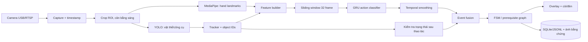

# Kế hoạch dự án Assembly Tracker

> Phiên bản: 1.0 — 24/08/2026  
> Mục tiêu: xây dựng MVP giám sát đúng/sai thứ tự lắp ráp bằng camera top-down, nhận diện tay–công cụ–linh kiện và kiểm tra quy trình bằng máy trạng thái.

## 1. Kết luận nhanh và phạm vi đề xuất

Khi chưa có sản phẩm mẫu, nên bắt đầu bằng một **bộ gá lắp ráp mô phỏng có 5 bước** thay vì cố thu thập ngay dữ liệu trên một bo mạch phức tạp. Bộ gá có thể là tấm mica/PCB hỏng/breadboard, một socket IC, một đầu nối, một nắp và hai vít. Mục tiêu của giai đoạn đầu là chứng minh được ba việc:

1. Hệ thống biết công nhân đang làm hành động nào.
2. Hệ thống biết bước nào đã hoàn tất thật sự, không chỉ thấy tay chuyển động.
3. Hệ thống báo được thao tác thiếu bước, sai thứ tự hoặc dùng sai linh kiện với độ trễ thấp.

Tên MVP đề xuất: **Assembly Tracker – Screw & Connector Board**.

Quy trình chuẩn:

```text
S0: bàn trống
  -> S1: đặt bo mạch vào đồ gá
  -> S2: cắm IC/khối linh kiện vào socket
  -> S3: cắm đầu nối dây
  -> S4: đặt nắp
  -> S5: siết vít A
  -> S6: siết vít B
  -> DONE
```

Các lỗi bắt buộc phải thử:

- Đặt nắp trước khi cắm IC.
- Siết vít khi chưa có nắp.
- Bỏ qua đầu nối dây.
- Dùng sai linh kiện hoặc sai vị trí.
- Tháo một chi tiết đã lắp rồi tiếp tục quy trình.
- Đưa tay/công cụ ngang qua vùng thao tác nhưng không thực hiện bước.

**Không nên dùng DeepPCB hoặc PKU-Market-PCB để huấn luyện nhánh hành động.** Hai bộ này phục vụ lỗi bề mặt PCB trên ảnh tĩnh; chúng chỉ hữu ích nếu sau này ghép thêm nhánh AOI. Assembly Tracker cần video có nhãn thời gian, tương tác tay–vật thể và trạng thái sau lắp ráp.

## 2. Các project và dataset tương tự nên tham khảo

| Nguồn | Điểm giống dự án | Nên học hoặc tái sử dụng | Giới hạn |
|---|---|---|---|
| [Assembly Guidance System / SMIRL](https://github.com/vigneshuw/app-AssemblyGuidanceSystem) | Nhận diện hành động lắp ráp kết hợp state machine và có GUI inference | Cách ghép mô hình nhận diện với trạng thái quy trình; cấu trúc app demo | Repo chính chưa kèm dữ liệu/video tương ứng với trọng số; phần object detection chưa có trên nhánh chính |
| [IndustReal](https://github.com/TimSchoonbeek/IndustReal) | Có action recognition, assembly-state detection và procedure-step recognition; có nhãn bước làm sai | Cách định nghĩa nhãn hành động, trạng thái chi tiết và bước hoàn tất; cách tách train/val/test | Góc nhìn egocentric từ HoloLens, không giống hoàn toàn camera top-down |
| [Assembly101](https://assembly-101.github.io/) và [code Temporal Action Segmentation](https://github.com/assembly-101/assembly101-temporal-action-segmentation) | Chuỗi lắp ráp dài, nhiều góc quay, có sai sót và sửa sai; có mã baseline phân đoạn hành động | Cách đánh giá action recognition, temporal segmentation và mistake detection | Rất lớn, nhiều lớp, không phù hợp để train toàn bộ cho MVP; giấy phép dữ liệu CC BY-NC 4.0, không dùng thương mại trực tiếp |
| [InHARD](https://github.com/vhavard/InHARD) | Nhận diện thao tác công nghiệp từ RGB/skeleton; có các lớp pick, place, assemble, consult | Thiết kế taxonomy động từ–đối tượng và baseline RNN/LSTM trên skeleton | Setup RGB-D và góc nhìn khác trạm top-down |
| [HA4M features](https://github.com/ispstiima/HA4Mfeatures) | Temporal action segmentation trong bối cảnh sản xuất, dùng đặc trưng hình ảnh và skeleton | Tham khảo pipeline đa phương thức và cách split theo người | Không phải code end-to-end cho đúng bộ gá của dự án |
| [MECCANO PSR annotations/tool](https://github.com/TimSchoonbeek/PSR-annotations) | Có công cụ tạo nhãn Procedure Step Recognition và Assembly State Detection | Tái sử dụng ý tưởng annotator và schema trạng thái từng bộ phận | Dữ liệu gốc egocentric và sản phẩm khác |
| [OpenMARCIE](https://github.com/HymalaiDFKI/OpenMarcie) | Hoạt động lắp ráp công nghiệp đa camera/đa cảm biến, gồm lắp máy in 3D theo hướng dẫn | Tham khảo thiết kế buổi quay, sự đa dạng người thực hiện và dữ liệu exocentric | Bộ dữ liệu lớn, đa phương thức quá mức cần thiết cho MVP |
| [IMPACT](https://diwen.ai/IMPACT/) | Lắp ráp công nghiệp, có nhiều lộ trình hợp lệ, lỗi và phục hồi lỗi | Ý tưởng prerequisite graph thay cho một chuỗi cứng khi quy trình phát triển | Mới và phức tạp hơn phạm vi MVP; bài báo vẫn đang trong quá trình phản biện tại thời điểm lập kế hoạch |

### Thứ tự nên đọc

1. Chạy thử hoặc đọc kiến trúc `AssemblyGuidanceSystem` vì sát bài toán nhất.
2. Dùng schema nhãn và tư duy PSR/ASD của `IndustReal`.
3. Tham khảo metric và temporal segmentation từ `Assembly101`.
4. Chỉ dùng `InHARD`, `HA4M`, `OpenMARCIE`, `IMPACT` để mở rộng hoặc làm phần related work.

## 3. Định nghĩa đầu ra và tiêu chí nghiệm thu

### 3.1. Đầu ra của hệ thống

Mỗi frame hoặc mỗi lần cập nhật phải có:

```json
{
  "timestamp_ms": 12840,
  "action": "insert_ic",
  "action_confidence": 0.91,
  "fsm_state": "S2_IC_INSTALLED",
  "completed_steps": ["place_board", "insert_ic"],
  "violation": null,
  "evidence": {
    "hand_near_ic_socket": true,
    "ic_present_after_action": true
  }
}
```

Khi có lỗi:

```json
{
  "violation": {
    "code": "OUT_OF_ORDER",
    "observed": "place_cover",
    "expected": ["connect_cable"],
    "message": "Chưa cắm đầu nối; không được đặt nắp",
    "first_seen_ms": 18620
  }
}
```

### 3.2. Tiêu chí nghiệm thu MVP

| Hạng mục | Mục tiêu |
|---|---:|
| Detector linh kiện/công cụ, mAP50 trên test | >= 0,85 |
| Action classifier, macro-F1 trên người chưa xuất hiện khi train | >= 0,85 |
| Recall phát hiện vi phạm quy trình | >= 0,90 |
| Precision cảnh báo vi phạm | >= 0,90 |
| Cảnh báo giả khi chạy đúng | <= 1 lần/30 phút |
| Độ trễ từ khi lỗi đủ bằng chứng đến cảnh báo | <= 1,0 giây |
| Tốc độ end-to-end trên Jetson | >= 15 FPS ở 720p ROI |
| Log | Lưu được timestamp, hành động, state, lỗi và ảnh bằng chứng |

Các ngưỡng trên là **mục tiêu nghiệm thu**, không phải kết quả được bảo đảm trước khi có dữ liệu thật.

## 4. Kiến trúc hệ thống đề xuất



### 4.1. Vì sao cần cả action và object state

Chỉ nhận diện hành động `tighten_screw` chưa đủ: người dùng có thể xoay tua-vít ngoài vị trí vít. Một bước chỉ được xác nhận khi có đồng thời:

- Hành động có xác suất đủ cao.
- Tay/công cụ tương tác đúng vùng.
- Trạng thái sau thao tác đã thay đổi hoặc tồn tại ổn định.
- Điều kiện tiên quyết trong FSM đã đạt.

Ví dụ: xác nhận `insert_ic` khi GRU nhận `insert_ic`, tay đi vào vùng socket, sau đó rời vùng và detector/ROI classifier thấy IC hiện diện liên tục tối thiểu 5 frame.

### 4.2. Detector và hand landmarks

Các lớp YOLO ban đầu:

```text
board, fixture, ic, connector, cable, cover,
screwdriver, screw_a, screw_b, wrong_part
```

MediaPipe Hand Landmarker cung cấp các mốc bàn tay; MVP chỉ cần cổ tay, đầu ngón cái, trỏ và tâm lòng bàn tay. Nếu găng tay, che khuất hoặc góc top-down làm landmark không ổn định, dùng bbox `hand` do YOLO phát hiện làm fallback.

Nên cố định camera và khai báo các vùng thao tác:

```text
ZONE_BOARD, ZONE_IC_SOCKET, ZONE_CONNECTOR,
ZONE_COVER, ZONE_SCREW_A, ZONE_SCREW_B, ZONE_TOOL_TRAY
```

Có thể đặt AprilTag ở bốn góc đồ gá trong bản thử nghiệm để tự hiệu chỉnh homography. Tag không phải đầu vào bắt buộc của sản phẩm cuối.

### 4.3. Vector đặc trưng cho GRU

Mỗi frame tạo một vector cố định, chuẩn hóa theo chiều rộng/cao ROI:

- Tọa độ và độ tin cậy của 5 mốc chính trên mỗi tay.
- Tâm, kích thước, confidence và cờ hiện diện của từng lớp vật thể.
- Khoảng cách tay–IC, tay–socket, tay–cover, tua-vít–vít A/B.
- Vận tốc và hướng chuyển động của tay/công cụ trong 1, 3 và 5 frame.
- Cờ tay/công cụ nằm trong từng zone.
- Trạng thái nhị phân/tam phân của từng chi tiết: `absent`, `present_uncertain`, `installed`.
- Mask cho landmark hoặc vật thể bị mất; không điền thiếu bằng tọa độ 0 mà không có mask.

Cấu hình ban đầu:

| Thành phần | Giá trị khởi đầu |
|---|---|
| Sampling cho temporal model | 10 FPS |
| Window | 32 frame, tương đương 3,2 giây |
| Stride inference | 2 frame |
| GRU | 2 tầng, hidden size 128, dropout 0,2 |
| Output | 9 lớp hành động gồm `idle` và `unknown` |
| Loss | weighted cross-entropy hoặc focal loss |
| Smoothing | median/EMA + yêu cầu 3/5 dự đoán đồng thuận |

Lớp hành động MVP:

```text
idle, place_board, insert_ic, connect_cable, place_cover,
tighten_screw, remove_part, inspect, unknown
```

Vít A/B được phân biệt bằng vị trí zone, không cần tách thành hai lớp hành động. Nếu cửa sổ 3,2 giây không bao phủ đủ thao tác siết, giữ GRU để nhận micro-action nhưng FSM tích lũy sự kiện đến khi thỏa điều kiện kết thúc.

### 4.4. FSM và xác nhận bước

FSM nên nằm trong file cấu hình thay vì hard-code:

```yaml
initial_state: EMPTY
states:
  EMPTY:
    allowed:
      place_board: BOARD_PLACED
  BOARD_PLACED:
    allowed:
      insert_ic: IC_INSTALLED
  IC_INSTALLED:
    allowed:
      connect_cable: CABLE_CONNECTED
    violations:
      place_cover: MISSING_CABLE
  CABLE_CONNECTED:
    allowed:
      place_cover: COVER_PLACED
  COVER_PLACED:
    allowed:
      tighten_screw@ZONE_SCREW_A: SCREW_A_DONE
      tighten_screw@ZONE_SCREW_B: SCREW_B_DONE
  SCREW_A_DONE:
    allowed:
      tighten_screw@ZONE_SCREW_B: DONE
  SCREW_B_DONE:
    allowed:
      tighten_screw@ZONE_SCREW_A: DONE
```

Hai vít có thể siết theo thứ tự bất kỳ. Đây là một ví dụ cho thấy hệ thống thực tế nên hỗ trợ **nhiều transition hợp lệ**; khi quy trình lớn hơn, chuyển FSM thành prerequisite graph/DAG.

Logic chống cảnh báo giả:

```python
if action_confidence >= ACTION_THRESHOLD:
    event = fuse(action, active_zone, object_state_change)
    if event.is_stable(min_frames=5):
        if fsm.can_transition(event):
            fsm.transition(event)
        elif fsm.is_known_violation(event):
            raise_alarm_after_confirmation(event)
        else:
            log_as_unknown_without_alarm(event)
```

Không phát cảnh báo từ một frame đơn. Lưu 2–3 giây video trước và sau sự kiện để truy vết.

## 5. Thiết kế bộ mẫu khi chưa có prototype

### 5.1. Bộ gá mô phỏng tối thiểu

| Thành phần | Cách làm rẻ và dễ thay thế |
|---|---|
| Đế/đồ gá | Mica, gỗ MDF hoặc khay in 3D có viền cố định |
| Bo mạch | PCB hỏng, perfboard hoặc tấm in màu có biên dạng rõ |
| IC | IC DIP rẻ hoặc khối in 3D có màu trung tính |
| Đầu nối | JST/Dupont loại lớn, có khóa định hướng |
| Nắp | Mica/nhựa in 3D, có hai lỗ vít |
| Vít | M3, hai vị trí cách nhau đủ xa |
| Tua-vít | Tua-vít cán màu dễ phát hiện |
| Camera | USB 1080p 30 FPS, tripod/khung cố định |
| Ánh sáng | LED ring hoặc hai thanh LED khuếch tán |

Trong tuần đầu, có thể dùng màu/AprilTag để tạo nhãn trạng thái tự động một phần. Sau khi pipeline ổn định, thay bằng linh kiện có bề ngoài gần thực tế để đánh giá đúng độ khó thị giác.

### 5.2. Quy tắc bố trí

- Camera vuông góc mặt bàn, không dùng autofocus nếu gây hunting.
- Khóa exposure và white balance sau khi chỉnh sáng.
- Vùng thao tác chiếm ít nhất 70% khung hình.
- Khay linh kiện không che khu vực lắp.
- Nền lì, tương phản nhưng không tạo shortcut chỉ tồn tại trong demo.
- Quay thêm điều kiện tay trái/tay phải, găng tay, tay áo và dịch chuyển đồ gá nhẹ.

## 6. Kế hoạch dữ liệu

### 6.1. Hai loại nhãn riêng biệt

**A. Nhãn detection trên frame**

- Bbox cho linh kiện, công cụ và tay fallback.
- Lấy mẫu 2–3 frame/giây từ video, tăng mật độ ở lúc bị che khuất.
- Mục tiêu MVP: 2.000–4.000 frame đã gán nhãn.

**B. Nhãn temporal trên video liên tục**

```csv
video_id,subject_id,start_frame,end_frame,verb,object,action,is_correct,error_type
run_001,p01,120,178,place,board,place_board,1,
run_001,p01,260,331,insert,ic,insert_ic,1,
run_014,p03,201,250,place,cover,place_cover,0,out_of_order
```

Kèm nhãn hoàn tất bước:

```csv
video_id,frame,step_id,result,evidence_note
run_001,181,place_board,correct,board stable in fixture
run_014,251,place_cover,incorrect,IC absent
```

### 6.2. Kịch bản quay

Không chỉ quay clip hành động đã cắt sẵn. Cần quay **full run liên tục** để mô hình học idle, chuyển tiếp, do dự, che khuất và sửa sai.

Mức tối thiểu hợp lý:

- 6–10 người.
- Mỗi người 10 quy trình đúng.
- Mỗi người 5 quy trình có lỗi được chỉ định.
- 90–150 full run, tương đương khoảng 2–4 giờ nếu mỗi run 1–2 phút.
- Quay thêm 20–30 phút negative footage: lấy đồ, nói chuyện, đi ngang, cầm tua-vít nhưng không thao tác.

Mỗi lỗi nên xuất hiện tối thiểu 20 lần trên toàn bộ dữ liệu. Nếu chỉ có 1–2 người, phải ghi rõ kết quả mới là proof-of-concept, chưa chứng minh khả năng tổng quát hóa.

### 6.3. Chia dữ liệu để tránh leakage

Chia theo **người thực hiện**, không chia ngẫu nhiên theo frame:

```text
train: 70% số người
val:   15% số người
test:  15% số người
```

Nếu chỉ có 6 người, dùng leave-one-subject-out hoặc giữ hẳn 1 người làm test. Tất cả frame/clip của cùng một full run phải nằm trong cùng split.

### 6.4. Kiểm soát chất lượng nhãn

- Viết annotation guideline một trang trước khi gán nhãn.
- Định nghĩa rõ thời điểm bắt đầu/kết thúc của từng action.
- Gán nhãn kép ít nhất 10% video.
- Kiểm tra IoU giữa bbox và độ lệch boundary temporal giữa hai người gán nhãn.
- Phiên bản hóa `labels_v001`, `labels_v002`; không sửa đè mà không có changelog.

## 7. Workflow phát triển end-to-end

### Giai đoạn A — Baseline không deep learning thời gian

1. Cố định camera, calibrate ROI và zone.
2. Chạy detector/marker để biết trạng thái chi tiết.
3. Viết FSM và log sự kiện.
4. Dùng luật khoảng cách tay–vật thể để tạo baseline.

Mục đích: kiểm chứng quy trình, UI và alarm trước khi tốn thời gian train GRU. Nếu FSM sai, mô hình tốt cũng không cứu được hệ thống.

### Giai đoạn B — Detector

1. Trích frame từ full run.
2. Gán bbox theo định dạng YOLO/COCO.
3. Fine-tune model nano từ pretrained weights.
4. Đánh giá per-class AP, confusion và lỗi theo mức che khuất.
5. Chạy detector trên toàn bộ video để sinh track và feature cache.

Không train detector và GRU trực tiếp cùng lúc ở MVP; lưu feature theo frame giúp thử nghiệm temporal model nhanh và tái lập được.

### Giai đoạn C — Temporal action model

1. Đồng bộ detection, hand landmarks và temporal labels theo timestamp.
2. Chuẩn hóa tọa độ theo ROI/homography.
3. Tạo sliding window 16, 32 và 48 frame.
4. So sánh ít nhất ba baseline:
   - Rule-based zone interaction.
   - MLP trên một frame/feature tổng hợp.
   - GRU/LSTM trên chuỗi.
5. Chọn model theo macro-F1 trên validation, không theo accuracy chung.
6. Tune threshold và smoothing trên validation duy nhất.
7. Khóa model rồi mới chạy test một lần cuối.

### Giai đoạn D — Tích hợp FSM

1. Chuyển dự đoán theo frame thành event có start/end.
2. Xác nhận event bằng object-state change.
3. Kiểm tra transition hợp lệ.
4. Phân loại lỗi: `OUT_OF_ORDER`, `MISSING_STEP`, `WRONG_PART`, `WRONG_LOCATION`, `REMOVAL`, `TIMEOUT`, `UNKNOWN`.
5. Thêm cơ chế acknowledge/reset/rework; công nhân phải có cách sửa lỗi mà không khởi động lại ứng dụng.

### Giai đoạn E — Deploy

1. Train trên máy RTX bằng PyTorch.
2. Export detector sang ONNX/TensorRT FP16; Ultralytics hỗ trợ export định dạng TensorRT `engine` ([tài liệu](https://docs.ultralytics.com/modes/export/)).
3. Giữ GRU ở TorchScript/ONNX hoặc TensorRT tùy benchmark thực tế.
4. Benchmark từng khối và toàn pipeline trên Jetson.
5. Nếu Python/OpenCV đạt >=15 FPS thì giữ kiến trúc đơn giản; chỉ chuyển sang DeepStream khi cần RTSP ổn định, nhiều luồng hoặc throughput cao. NVIDIA DeepStream hỗ trợ Jetson Orin và dùng TensorRT trong pipeline ([tài liệu](https://docs.nvidia.com/metropolis/deepstream/dev-guide/text/DS_Overview.html)).
6. Burn-in ít nhất 2 giờ, theo dõi nhiệt độ, dropped frames, memory và log consistency.

## 8. Cấu trúc repository đề xuất

```text
assembly-tracker/
├── README.md
├── configs/
│   ├── camera.yaml
│   ├── zones.yaml
│   ├── fsm.yaml
│   └── classes.yaml
├── data/
│   ├── raw/                 # không commit video lớn
│   ├── annotations/
│   ├── splits/
│   ├── frames/
│   └── features/
├── models/
│   ├── detector/
│   └── action_gru/
├── src/
│   ├── capture/
│   ├── perception/
│   ├── features/
│   ├── temporal/
│   ├── procedure/
│   ├── ui/
│   └── logging/
├── scripts/
│   ├── extract_frames.py
│   ├── build_features.py
│   ├── train_detector.py
│   ├── train_action.py
│   ├── evaluate_e2e.py
│   └── export_tensorrt.py
├── tests/
│   ├── test_fsm.py
│   ├── test_feature_schema.py
│   └── test_video_regression.py
├── artifacts/               # model, report, confusion matrix
└── app.py
```

Quy ước dữ liệu:

```text
run_YYYYMMDD_subject##_scenario##_take##.mp4
```

Mọi file prediction phải lưu `model_version`, `config_hash`, `video_id` và timestamp để có thể tái lập.

## 9. Phần mềm và phần cứng

### 9.1. Stack phần mềm

| Nhóm | Lựa chọn đề xuất |
|---|---|
| Ngôn ngữ | Python 3.10/3.11 tùy JetPack/PyTorch tương thích |
| Video/CV | OpenCV, GStreamer nếu dùng RTSP |
| Detector | Ultralytics YOLO nano hoặc implementation tương đương |
| Hand tracking | MediaPipe Hand Landmarker ([API chính thức](https://ai.google.dev/edge/api/mediapipe/python/mp/tasks/vision)) |
| Temporal model | PyTorch GRU/LSTM |
| Deploy NVIDIA | ONNX, TensorRT FP16; DeepStream khi cần |
| Nhãn | CVAT hoặc công cụ video annotation hỗ trợ segment + bbox |
| UI/API | OpenCV overlay cho MVP; FastAPI + web UI ở giai đoạn sau |
| Log | JSONL trong phát triển, SQLite khi demo |
| Thí nghiệm | TensorBoard hoặc MLflow; Git + DVC nếu dữ liệu lớn |

Lưu ý: kiểm tra giấy phép của model/code/dataset trước khi chuyển từ nghiên cứu sang sản phẩm thương mại. Đặc biệt, Assembly101 công bố dữ liệu theo CC BY-NC 4.0.

### 9.2. Cấu hình phần cứng

**Phát triển:** PC có NVIDIA RTX, RAM >=16 GB, SSD còn trống >=100 GB.  
**Triển khai:** Jetson Orin Nano, camera USB 1080p 30 FPS, nguồn sáng khuếch tán, SSD/NVMe nếu lưu video.  
**MVP tiết kiệm:** có thể train/inference ban đầu hoàn toàn trên PC RTX; chỉ mua Jetson sau khi pipeline đạt metric offline.

Vòng đèn điều khiển từng góc chưa cần cho Assembly Tracker nếu ánh sáng đều. Tính năng bật tuần tự theo góc phù hợp hơn với nhánh AOI/photometric inspection; ở nhánh hành động nó làm hình ảnh thay đổi theo thời gian và có thể gây nhiễu model.

## 10. Kế hoạch 12 tuần

| Tuần | Công việc | Deliverable |
|---:|---|---|
| 1 | Chốt 5–7 bước, làm mockup, đặt camera và ánh sáng | Bộ gá + SOP + sơ đồ zone |
| 2 | Capture app, timestamp, record/replay, FSM thủ công | Video recorder + FSM unit tests |
| 3 | Quay pilot 10–15 run, viết guideline nhãn | Pilot dataset v0 |
| 4 | Gán bbox, train detector lần 1 | Detector baseline + error report |
| 5 | Quay dữ liệu chính với nhiều người/kịch bản lỗi | Raw dataset v1 |
| 6 | Hoàn tất detection/temporal labels, khóa split | Dataset v1 + data card |
| 7 | Trích hand/object features, rule/MLP baselines | Feature cache + baseline metrics |
| 8 | Train GRU/LSTM, ablation window/feature | Action model v1 |
| 9 | Event fusion, object-state confirmation, FSM | Offline end-to-end demo |
| 10 | UI, alarm, log, ảnh/video bằng chứng | Usable desktop demo |
| 11 | Export TensorRT, benchmark Jetson, tối ưu | Edge build + benchmark report |
| 12 | Test người mới, test sai quy trình, burn-in | Final report + video demo |

Nếu chỉ có 6–8 tuần, bỏ MediaPipe nếu detector tay đủ tốt, dùng một loại camera USB, chỉ giữ 5 bước và deploy trên PC RTX trước.

## 11. Test plan

### 11.1. Unit test

- Mọi transition hợp lệ của FSM.
- Mọi transition sai và error code tương ứng.
- Reset, undo/rework và mất điện/khởi động lại.
- Feature vector luôn đúng kích thước khi mất tay/vật thể.
- Timestamp tăng đơn điệu và xử lý dropped frame.

### 11.2. Offline evaluation

- Detector: mAP50, mAP50–95 và per-class precision/recall.
- Action: macro-F1, per-class F1, confusion matrix.
- Temporal: segmental F1@10/25/50, edit score, boundary delay.
- Procedure: step-completion precision/recall, violation precision/recall.
- Chạy theo nhóm: người mới, tay trái, găng tay, che khuất, ánh sáng yếu.

### 11.3. End-to-end scenario test

| ID | Kịch bản | Kết quả mong đợi |
|---|---|---|
| T01 | Làm đúng toàn bộ | Không cảnh báo, state tới DONE |
| T02 | Đặt nắp trước cắm dây | Báo `MISSING_CABLE`, state không tiến |
| T03 | Giả vờ siết ngoài vùng vít | Không xác nhận bước, không cảnh báo sai không cần thiết |
| T04 | Siết B trước A | Hợp lệ nếu SOP cho phép |
| T05 | Tháo IC sau khi đã lắp | Báo `REMOVAL`, chuyển vào rework |
| T06 | Tay che IC 2 giây | Không rollback state chỉ vì detection tạm mất |
| T07 | Đặt sai linh kiện vào socket | Báo `WRONG_PART` |
| T08 | Camera mất 1 giây | Ghi lỗi camera, không tự suy diễn bước mới |
| T09 | Hai tay thao tác đồng thời | Chọn active hand/zone đúng hoặc gắn nhãn `unknown` |
| T10 | Người mới chưa có trong train | Đạt tiêu chí macro-F1 và violation recall |

## 12. Rủi ro chính và cách giảm thiểu

| Rủi ro | Tác động | Giảm thiểu |
|---|---|---|
| Tay che linh kiện nhỏ | Không biết trạng thái sau lắp | Xác nhận sau khi tay rời zone; dùng trạng thái bền theo thời gian; đổi nhẹ góc camera hoặc thêm camera phụ sau MVP |
| Các thao tác có chuyển động giống nhau | Nhầm lớp action | Dùng động từ + đối tượng + zone; không chỉ dùng skeleton |
| `idle` lấn át dữ liệu | Accuracy cao giả tạo | Downsample idle, weighted loss, báo macro-F1 |
| Học thuộc người/nền | Test thực tế giảm mạnh | Split theo người, random vị trí khay, thêm tay áo/găng/ánh sáng |
| FSM quá cứng | Báo sai khi có nhiều thứ tự hợp lệ | Mô tả prerequisite graph, cho nhiều transition và rework path |
| Cảnh báo quá sớm | Gây khó chịu, mất niềm tin | Debounce 3/5, dwell time, object-state confirmation |
| GRU window quá ngắn | Bỏ lỡ thao tác dài | Test 16/32/48; tách action onset và completion event |
| Jetson không đạt FPS | Demo giật/độ trễ cao | Crop ROI, infer detector ở 10–15 FPS, FP16 TensorRT, reuse tracking giữa các frame |
| Dataset public lệch domain | Transfer kém | Chỉ dùng để tham khảo/pretrain feature; fine-tune và test trên dữ liệu top-down tự quay |

## 13. Quyết định kỹ thuật quan trọng

1. **Ưu tiên trạng thái hoàn tất hơn chỉ phân loại hành động.** Đây là khác biệt giữa demo action recognition và hệ thống kiểm lỗi quy trình.
2. **Giữ FSM deterministic.** Model tạo bằng chứng; quy tắc nghiệp vụ quyết định đúng/sai để dễ giải thích và sửa SOP.
3. **Dùng GRU trước LSTM.** GRU nhẹ hơn và thường đủ cho vector tọa độ nhỏ; chỉ chọn LSTM nếu validation chứng minh tốt hơn.
4. **Không lấy 30 FPS làm input temporal mặc định.** Sampling 10 FPS giảm ba lần chi phí và cửa sổ 32 frame bao phủ 3,2 giây.
5. **Không cảnh báo `unknown`.** Unknown được log để bổ sung dữ liệu; chỉ cảnh báo khi bằng chứng vi phạm đủ rõ.
6. **Test theo người chưa thấy khi train.** Đây là điều kiện gần thực tế hơn random frame split.

## 14. Mốc “go/no-go”

### Sau tuần 3

Go nếu camera nhìn rõ mọi trạng thái và con người có thể phân biệt action/state từ video. Nếu người gán nhãn cũng không phân biệt được, phải sửa bộ gá/góc quay trước khi train.

### Sau tuần 6

Go nếu detector đạt recall đủ cao cho các chi tiết bắt buộc và dữ liệu có ít nhất 20 ví dụ cho mỗi lỗi chính. Nếu không, quay bổ sung có mục tiêu.

### Sau tuần 9

Go deploy nếu offline end-to-end đạt precision/recall cảnh báo >=0,90 trên test người mới. Nếu action model tốt nhưng cảnh báo kém, sửa event fusion/FSM trước khi đổi backbone lớn hơn.

## 15. Deliverable cuối kỳ

- Bộ gá mô phỏng và SOP 5–7 bước.
- Dataset card, annotation guideline và split theo người.
- Detector, GRU/LSTM, file cấu hình zone/FSM và model card.
- Ứng dụng live có overlay, trạng thái, cảnh báo và reset/rework.
- Log SQLite/JSONL và ảnh/video bằng chứng.
- Báo cáo metric detector/action/procedure/end-to-end.
- Benchmark PC RTX và Jetson Orin Nano.
- Video demo gồm ít nhất một run đúng và ba loại lỗi.
- Hướng dẫn cài đặt, train, export và chạy inference.

## 16. Checklist bắt đầu ngay

- [ ] Chốt 5–7 bước và các thứ tự được phép.
- [ ] Làm bộ gá mô phỏng; chưa cần PCB thật.
- [ ] Vẽ vùng thao tác trên một ảnh camera mẫu.
- [ ] Quay 10 full run pilot, gồm đúng và sai.
- [ ] Viết schema nhãn action, state và error.
- [ ] Cài recorder/replay và FSM baseline.
- [ ] Gán thử 200 frame detector và 10 video temporal.
- [ ] Train detector nhỏ để kiểm tra khả năng nhìn thấy chi tiết.
- [ ] Chỉ sau pilot mới quyết định số camera và có cần MediaPipe hay không.

---

### Tài liệu gốc chính

- Selvaraj và cộng sự, repo [Assembly Guidance System / SMIRL](https://github.com/vigneshuw/app-AssemblyGuidanceSystem).
- Schoonbeek và cộng sự, [IndustReal repository](https://github.com/TimSchoonbeek/IndustReal) và [paper WACV 2024](https://openaccess.thecvf.com/content/WACV2024/papers/Schoonbeek_IndustReal_A_Dataset_for_Procedure_Step_Recognition_Handling_Execution_Errors_WACV_2024_paper.pdf).
- Sener và cộng sự, [Assembly101 project](https://assembly-101.github.io/) và [temporal action segmentation code](https://github.com/assembly-101/assembly101-temporal-action-segmentation).
- Dallel và cộng sự, [InHARD](https://github.com/vhavard/InHARD).
- [HA4M temporal action segmentation features](https://github.com/ispstiima/HA4Mfeatures).
- [OpenMARCIE](https://github.com/HymalaiDFKI/OpenMarcie).
- [IMPACT industrial procedural action benchmark](https://diwen.ai/IMPACT/).

