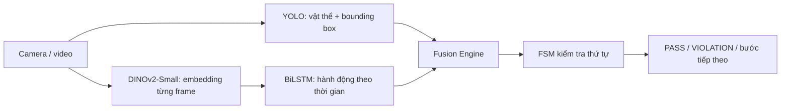

# Earbud Hybrid Assembly Monitor

Hệ thống giám sát thao tác lắp hai tai nghe vào hộp sạc bằng camera. Bản làm việc duy nhất là `G:\Internship\RBCNN_Demo`.

Quy trình mục tiêu v2:

```text
mở hộp → lắp tai thứ nhất → lắp tai thứ hai → đóng hộp
```

Đây là prototype nghiên cứu. Camera 2D không xác nhận được tiếp xúc điện hay chất lượng sạc.

## Kiến trúc



- YOLO trả lời vật gì đang ở đâu và số khe còn trống.
- DINOv2 + BiLSTM nhận diện sáu nhãn hành động: `idle`, `open_case`, `insert_first_earbud`, `insert_second_earbud`, `close_case`, `remove_earbud`.
- Fusion chỉ chấp nhận bước lắp khi hành động và thay đổi vật lý cùng khớp.
- FSM quản lý thứ tự, lỗi đóng sớm và việc tai nghe bị lấy ra.

## Hai profile đang được giữ

| Profile | Mục đích | Trạng thái |
|---|---|---|
| `configs/projects/earbud.json` | Tái hiện baseline cũ 4 nhãn và detector 6 lớp | Chỉ để đối chiếu |
| `configs/projects/earbud_v2.json` | Hướng chính: 5 action, DINOv2-Small, hai lần lắp riêng | Đang xây dựng |

Không dùng checkpoint baseline với config v2. Thứ tự lớp và kích thước embedding phải khớp checkpoint.

## Hiện trạng thật

- Có video local trong `data/earbud_actions/raw_videos/`.
- `data/earbud_actions/annotations_v2.csv` mới chỉ có header: bạn vẫn phải gán nhãn v2.
- Detector baseline cũ nằm trong `artifacts/training/earbud_merged_detector/`; nó không khớp detector geometry 6 lớp trái/phải.
- Chưa có `artifacts/training/earbud_geometry_detector/weights/best.pt`.
- Chưa có `artifacts/action_model_v2/best.pt`.
- Python hiện tại đang dùng PyTorch CPU; muốn dùng NVIDIA GPU phải cài bản PyTorch CUDA phù hợp.

## Cài đặt

```powershell
cd "G:\Internship\RBCNN_Demo"
python -m venv .venv
.\.venv\Scripts\Activate.ps1
python -m pip install --upgrade pip
python -m pip install -r requirements-camera.txt
python -m pip install -r requirements-ml.txt
python -m pip install -e .
```

Kiểm tra GPU:

```powershell
python -c "import torch; print(torch.__version__); print(torch.cuda.is_available()); print(torch.cuda.get_device_name(0) if torch.cuda.is_available() else 'CPU')"
```

## Chạy camera

Liệt kê camera:

```powershell
python scripts/run_earbud.py --list-cameras
```

Chạy camera laptop hoặc camera USB:

```powershell
python scripts/run_earbud.py --mode camera --source 0 --auto-advance
python scripts/run_earbud.py --mode camera --source 1 --auto-advance
```

Trong cửa sổ: `C` đổi camera, `S` chụp ảnh có overlay, `R` reset, `Q`/`Esc` thoát. Ảnh chụp được lưu tại `artifacts/screenshots/`.

Runtime sẽ dừng với thông báo rõ nếu checkpoint geometry v2 chưa có. Xem [hướng dẫn camera](docs/CAMERA_REALTIME.md) và [việc bạn cần làm](docs/VIEC_BAN_CAN_LAM.md).

## Pipeline action v2

Làm đúng thứ tự:

```text
Annotation → split theo video/session → DINOv2 feature → train BiLSTM → evaluation
```

Toàn bộ lệnh và quy tắc gán sáu nhãn nằm trong [LSTM_Training_Guide.md](docs/LSTM_Training_Guide.md).

## Cấu trúc chính

```text
RBCNN_Demo/
├── configs/              # Profile camera, action model và FSM
├── data/earbud_actions/  # Video, annotation và feature local
├── datasets/             # Dataset YOLO local
├── artifacts/            # Checkpoint, log và ảnh kết quả local
├── scripts/              # Thu dữ liệu, train, đánh giá và runtime
├── src/assembly/         # Code dùng lại: detector, model, fusion, FSM
├── tests/                # Unit/integration test
└── docs/                 # Hướng dẫn hiện hành
```

## Dùng cho sản phẩm khác

Giữ code dùng chung, tạo profile và logic fusion mới thay vì sửa profile earbud:

```text
configs/projects/<project>.json
configs/camera_<project>_config.json
configs/action_<project>_config.json
configs/<project>_fsm_config.json
src/assembly/<project>_fusion.py
```

## Kiểm thử

```powershell
python -m unittest discover -s tests -v
```

Dataset, video, feature và checkpoint lớn bị loại khỏi Git bởi `.gitignore`; chỉ code, config, annotation nhỏ và tài liệu được push lên GitHub.

## Tài liệu

- [Việc bạn cần làm](docs/VIEC_BAN_CAN_LAM.md)
- [Notebook Kaggle: sửa DATASET_ROOTS rồi Run All](Kaggle_Training_Earbud.ipynb)
- [Train Earbud Detect COCO trên Kaggle](docs/KAGGLE_TRAIN_EARBUD_COCO.md)
- [Năm bước train action v2](docs/LSTM_Training_Guide.md)
- [Chạy camera và thu ảnh YOLO](docs/CAMERA_REALTIME.md)
- [Thiết kế Hybrid](docs/HYBRID_VIT_LSTM_ASSEMBLY_PLAN.md)
- [Tóm tắt hợp nhất repo](docs/TOM_TAT_HOP_NHAT_REPO_20260922.md)
