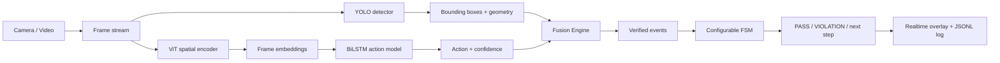

# Hybrid Assembly Monitor

Khung giám sát quy trình lắp ráp bằng camera, kết hợp:

- **YOLO** để nhận diện và khoanh vùng linh kiện.
- **ViT + BiLSTM** để nhận diện hành động theo chuỗi thời gian.
- **Fusion Engine** để đối chiếu hành động với trạng thái vật thể.
- **FSM** để kiểm tra đúng bước, sai thứ tự và bỏ sót công đoạn.

Project mẫu hiện tại là quy trình hộp tai nghe:

```text
đặt hộp → lắp tai nghe thứ nhất → lắp tai nghe thứ hai → đóng nắp
```

Đây là prototype nghiên cứu, chưa phải thiết bị kiểm định chất lượng sản xuất.

## Kiến trúc



YOLO trả lời **vật gì đang ở đâu**. ViT–BiLSTM trả lời **người dùng đang làm gì**. Fusion Engine chỉ phát một sự kiện khi bằng chứng hành động và thay đổi vật lý phù hợp; FSM quyết định sự kiện đó có đúng thứ tự hay không.

## Cài đặt

Yêu cầu Python 3.10 trở lên. Nên dùng virtual environment.

```powershell
python -m venv .venv
.venv\Scripts\Activate.ps1
python -m pip install --upgrade pip
python -m pip install -r requirements-camera.txt
python -m pip install -r requirements-ml.txt
python -m pip install -e .
```

Hai checkpoint cần có trên máy:

```text
artifacts/training/earbud_merged_detector/weights/best.pt
artifacts/action_model/best.pt
```

Dataset, video và checkpoint không được đưa vào Git vì dung lượng lớn. Xem phần “Dữ liệu và model” bên dưới.

## Chạy hệ thống

### Chế độ YOLO + hình học hai tai (không cần LSTM)

Chế độ mới kiểm tra trực tiếp `open_case`, hai box `earbud` nằm trong hộp và số khe `empty_left`/`empty_right` giảm từ 2 → 1 → 0:

```powershell
powershell -ExecutionPolicy Bypass -File scripts/setup_camera.ps1

.\.venv\Scripts\python.exe scripts\run_earbud.py `
  --mode camera `
  --source 0 `
  --auto-advance
```

Checkpoint cho chế độ này phải được train đúng năm lớp `open_case`, `close_case`, `earbud`, `empty_left`, `empty_right`. Xem [hướng dẫn gán nhãn và chạy thử](docs/VIEC_BAN_CAN_LAM_GEOMETRY.md).

Runtime geometry đã được tối ưu để camera không chờ YOLO: inference chạy trên luồng nền, chỉ giữ frame mới nhất, camera đặt 960×540 với buffer một frame, YOLO dùng ảnh 512 px và tự bật FP16/cuDNN khi có NVIDIA GPU. Overlay hiển thị riêng `Display FPS`, `AI FPS`, `inside=N/2` và `empty=N/2`.

### Chế độ Hybrid YOLO + ViT–BiLSTM

Camera laptop:

```powershell
python scripts/run_hybrid.py --project configs/projects/earbud.json --source 0
```

Camera USB thường là `1` hoặc `2`:

```powershell
python scripts/run_hybrid.py --project configs/projects/earbud.json --source 1
```

Lệnh tương thích cũ vẫn hoạt động:

```powershell
python scripts/run_earbud_hybrid.py --source 0
```

Máy chỉ có CPU:

```powershell
python scripts/run_hybrid.py `
  --project configs/projects/earbud.json `
  --source 0 `
  --device cpu `
  --sample-fps 3 `
  --yolo-every 4
```

Phím điều khiển:

| Phím | Chức năng |
|---|---|
| `R` | Reset FSM, Fusion Engine và temporal buffer |
| `Q` hoặc `Esc` | Thoát |

## Cấu trúc repository

```text
RBCNN_Demo/
├── configs/
│   ├── projects/                 # Profile kết nối toàn bộ thành phần của từng dự án
│   │   └── earbud.json
│   ├── camera_earbud_config.json # Detector, class, confidence, work zone
│   ├── action_earbud_config.json # ViT, BiLSTM, action labels
│   └── earbud_two_step_fsm_config.json
├── src/assembly/
│   ├── models/                   # ViT encoder và BiLSTM
│   ├── project_config.py         # Nạp profile và Fusion Engine động
│   ├── earbud_fusion.py          # Logic hình học riêng cho tai nghe
│   ├── fsm.py                    # FSM dùng chung, không gắn với sản phẩm
│   ├── vision.py                 # Box, containment, overlap
│   └── monitor.py                # Điều phối kết quả và event log
├── scripts/
│   ├── run_hybrid.py             # Runtime dùng chung cho mọi project profile
│   ├── run_earbud_hybrid.py      # Wrapper tương thích cho project tai nghe
│   ├── train_detector.py
│   ├── train_action_model.py
│   ├── evaluate_action_model.py
│   └── validate_detection_dataset.py
├── tests/                        # Unit test cho config, FSM, geometry và model
├── docs/                         # Thiết kế và hướng dẫn thu thập dữ liệu
├── datasets/                     # Dữ liệu local, không commit
├── data/                         # Video/action annotations local
└── artifacts/                    # Checkpoint, log và kết quả chạy local
```

## Dùng khung này cho dự án khác

Ví dụ dự án tiếp theo là lắp PCB. Không sửa trực tiếp cấu hình earbud; tạo bộ file mới:

```text
configs/projects/pcb.json
configs/camera_pcb_config.json
configs/action_pcb_config.json
configs/pcb_fsm_config.json
src/assembly/pcb_fusion.py
```

### 1. Detector

Tạo dataset YOLO với các lớp phù hợp, ví dụ `PCB`, `Connector`, `Screw`, `Cable`, `Hand`. Sau đó cập nhật `camera_pcb_config.json` và đường dẫn `best.pt`.

### 2. Action model

Quay video, gán nhãn các hành động như `place_board`, `insert_connector`, `tighten_screw`, rồi tạo `action_pcb_config.json` và train checkpoint mới.

### 3. FSM

Mô tả thứ tự hợp lệ và thông báo vi phạm trong `pcb_fsm_config.json`. `ConfigurableAssemblyTracker` dùng được ngay, không cần sửa code FSM.

### 4. Fusion Engine

Tạo class riêng có ba thành phần sau:

```python
class PcbFusionEngine:
    @property
    def status_text(self) -> str:
        ...

    def update(self, detections, action_prediction):
        # Trả về None hoặc object có action, confidence, reason.
        ...

    def reset(self) -> None:
        ...
```

Fusion Engine là nơi viết quy tắc vật lý riêng cho sản phẩm, ví dụ connector phải nằm trong socket hoặc vít phải nằm trong vùng lỗ vít.

### 5. Project profile

Profile nối tất cả thành phần mà không sửa `run_hybrid.py`:

```json
{
  "schema_version": 1,
  "name": "pcb",
  "display_name": "PCB Assembly Monitor",
  "camera_config": "configs/camera_pcb_config.json",
  "fsm_config": "configs/pcb_fsm_config.json",
  "action_config": "configs/action_pcb_config.json",
  "action_model": "artifacts/action_model_pcb/best.pt",
  "event_log": "artifacts/events/pcb.jsonl",
  "fusion": {
    "factory": "assembly.pcb_fusion:PcbFusionEngine",
    "parameters": {
      "stable_frames": 3,
      "min_action_confidence": 0.6
    }
  }
}
```

Chạy dự án mới:

```powershell
python scripts/run_hybrid.py --project configs/projects/pcb.json --source 0
```

## Huấn luyện và kiểm tra

Kiểm tra dataset detection:

```powershell
python scripts/validate_detection_dataset.py --data datasets/earbud_merged/data.yaml
```

Train YOLO:

```powershell
python scripts/train_detector.py `
  --data datasets/earbud_merged/data.yaml `
  --model yolov8n.pt `
  --epochs 60
```

Pipeline action recognition:

```powershell
python scripts/extract_spatial_features.py
python scripts/verify_pipeline.py
python scripts/train_action_model.py
python scripts/evaluate_action_model.py --split test
```

Chạy test:

```powershell
python -m unittest discover -s tests -v
```

## Dữ liệu và model

Repository chỉ lưu code, config, annotation nhỏ và tài liệu Markdown. Các mục sau được giữ local nhưng bị `.gitignore` loại khỏi Git:

- `datasets/`: ảnh và label YOLO.
- `data/**/raw_videos/`: video gốc.
- `data/**/features/`: embedding có thể tạo lại.
- `artifacts/`: checkpoint, log, ảnh inference và kết quả train.
- `*.pt`, `*.h5`, `*.zip`, `*.docx`.

Khi chia sẻ model, dùng GitHub Release, Google Drive, Hugging Face Hub hoặc một kho lưu trữ model; không commit trực tiếp checkpoint lớn vào Git thông thường.

## Tài liệu

- [Việc cần làm](docs/VIEC_BAN_CAN_LAM.md)
- [Thiết kế Hybrid ViT + LSTM](docs/HYBRID_VIT_LSTM_ASSEMBLY_PLAN.md)
- [Hướng dẫn train LSTM](docs/LSTM_Training_Guide.md)
- [Kế hoạch Assembly Tracker mở rộng](docs/plan.md)
