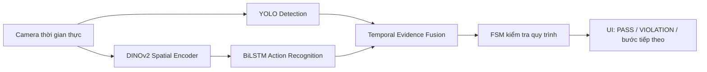
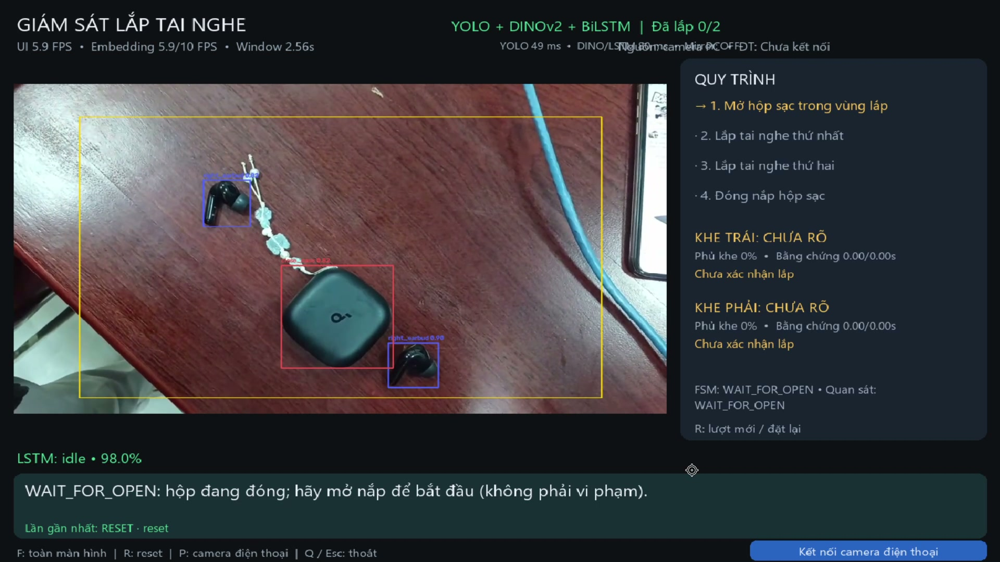
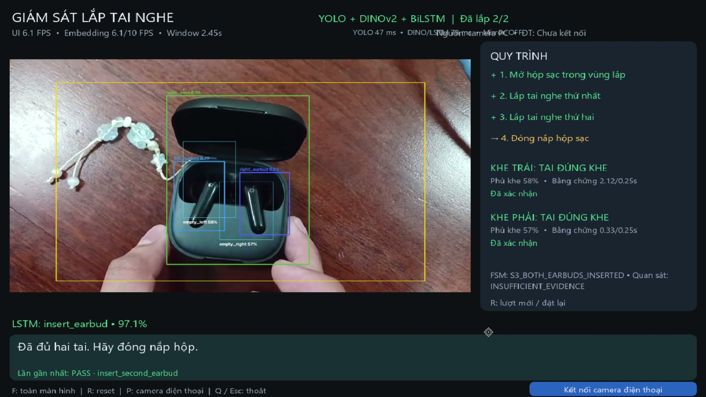
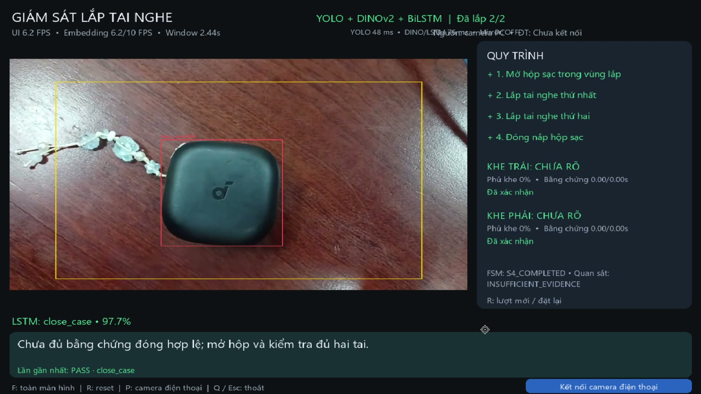
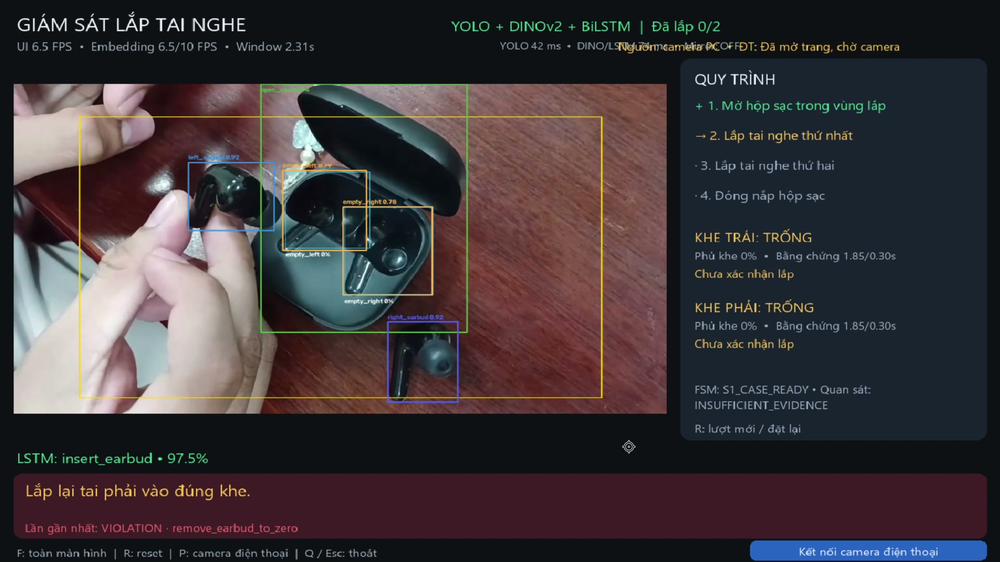
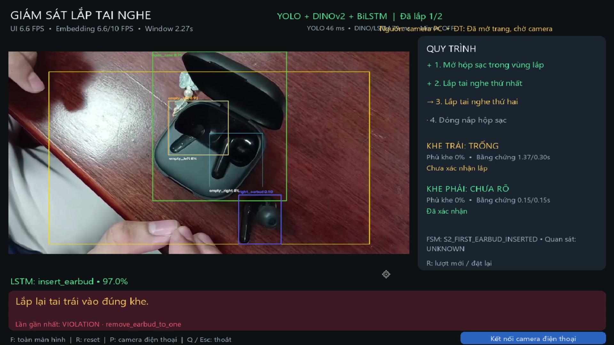
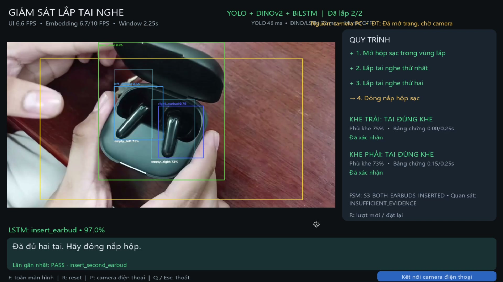
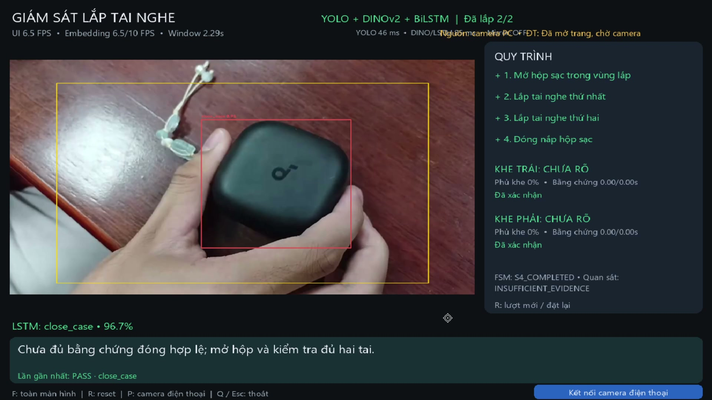

# BÁO CÁO KẾT QUẢ THỬ NGHIỆM

## HỆ THỐNG HYBRID YOLO + DINOV2 + BILSTM GIÁM SÁT QUY TRÌNH LẮP TAI NGHE

| Thông tin | Nội dung |
|---|---|
| Loại tài liệu | Báo cáo kết quả thử nghiệm nguyên mẫu |
| Ngày thử nghiệm | 29/09/2026 |
| Video minh chứng | `tests/2026-09-29 10-17-04.mp4` (quy trình đúng) và `tests/2026-09-29 15-43-35.mp4` (kịch bản lỗi/sửa sai) |
| Thời lượng video | 104,57 giây và 71,97 giây |
| Định dạng | MP4, 1920×1080, 60 FPS |
| Phiên bản hệ thống | Reliable Generic Insert Pipeline |
| Người thực hiện | ........................................................ |
| Người hướng dẫn/Quản lý | ........................................................ |

---

## TÓM TẮT

Báo cáo trình bày kết quả thử nghiệm nguyên mẫu hệ thống giám sát quy trình lắp tai nghe vào hộp sạc bằng thị giác máy tính. Hệ thống sử dụng YOLO để phát hiện hộp sạc, tai nghe trái/phải và các vùng khe cắm; DINOv2 kết hợp BiLSTM để nhận diện hành động theo chuỗi thời gian; Temporal Fusion để tích lũy bằng chứng hình học; và máy trạng thái hữu hạn (FSM) để kiểm tra thứ tự quy trình.

Hai video holdout được dùng để kiểm chứng hai hướng vận hành. Ở video quy trình đúng, hệ thống xác nhận đầy đủ bốn bước: mở hộp, lắp tai nghe thứ nhất, lắp tai nghe thứ hai và đóng hộp; trạng thái cuối đạt `S4_COMPLETED`, tiến độ `2/2`. Ở video kịch bản lỗi, hệ thống phát hiện việc tai nghe đã xác nhận bị lấy ra, sinh các sự kiện `remove_earbud_to_one` và `remove_earbud_to_zero`, hướng dẫn người dùng lắp lại, sau đó tiếp tục xác nhận thao tác sửa sai và hoàn tất chu trình. Confidence của mô hình hành động tại các giai đoạn chính chủ yếu nằm trong khoảng 94–98%.

Trong thời gian tay che hoặc bounding box chưa ổn định, hệ thống chuyển sang `UNKNOWN`/`INSUFFICIENT_EVIDENCE` thay vì kết luận vi phạm ngay từ một frame. Kết quả này cho thấy Temporal Fusion và FSM đã có khả năng vừa bảo toàn tiến độ khi bằng chứng tạm thời không rõ, vừa rollback có kiểm soát khi bằng chứng tháo tai tồn tại đủ lâu.

Kết quả chứng minh giải pháp hybrid có tính khả thi ở mức nguyên mẫu đối với cả luồng đúng và một luồng lỗi có sửa sai. Tuy nhiên, đây mới là phân tích định tính trên hai video; tốc độ embedding thực tế mới đạt khoảng 5,3–6,7 FPS so với mục tiêu 10 FPS, nhánh phát hiện `wrong_side` chưa được chứng minh độc lập và giao diện vẫn còn một số điểm cần hoàn thiện.

**Từ khóa:** Computer Vision, YOLO, DINOv2, BiLSTM, Temporal Fusion, FSM, giám sát lắp ráp.

---

# 1. GIỚI THIỆU

## 1.1. Bối cảnh

Trong các công đoạn lắp ráp thủ công, việc kiểm tra bằng mắt phụ thuộc nhiều vào người vận hành và khó lưu lại bằng chứng cho từng bước. Một hệ thống camera có khả năng phát hiện linh kiện, nhận diện hành động và kiểm tra thứ tự thao tác có thể hỗ trợ:

- giám sát tiến độ lắp ráp theo thời gian thực;
- cảnh báo thao tác sai thứ tự hoặc sai vị trí;
- giảm phụ thuộc vào kiểm tra thủ công;
- tạo nền tảng để mở rộng sang các bài toán lắp ráp PCB hoặc thiết bị điện tử.

Đề tài chọn quy trình lắp tai nghe làm mô hình thu nhỏ vì linh kiện có kích thước nhỏ, có phân biệt trái/phải và có yêu cầu vị trí lắp cụ thể. Đây là bài toán phù hợp để kiểm chứng kiến trúc trước khi chuyển sang dây chuyền phức tạp hơn.

## 1.2. Mục tiêu thử nghiệm

Thử nghiệm nhằm đánh giá các khả năng sau:

1. Phát hiện được hộp sạc, tai nghe trái/phải và vùng khe cắm.
2. Nhận diện được hành động tổng quát `open_case`, `insert_earbud` và `close_case`.
3. Kết hợp bằng chứng hành động và hình học để xác nhận lần lắp thứ nhất/thứ hai.
4. Duy trì đúng tiến độ khi tay che, bbox dao động hoặc chưa đủ bằng chứng.
5. Hoàn tất FSM theo đúng thứ tự mà không xuất hiện cảnh báo vi phạm giả.

## 1.3. Phạm vi

Báo cáo phân tích hai video quay màn hình độc lập: một lượt thao tác đúng và một lượt có tháo tai/sửa sai. Hai video được giữ làm holdout regression test và không dùng để huấn luyện. Vì cỡ mẫu còn nhỏ, kết quả phản ánh **tính khả thi chức năng**, chưa đại diện cho độ chính xác thống kê hay mức sẵn sàng triển khai sản xuất.

---

# 2. KIẾN TRÚC HỆ THỐNG

## 2.1. Sơ đồ tổng thể



## 2.2. Vai trò từng thành phần

### YOLO — nhận diện đối tượng và hình học

YOLO trả lời câu hỏi “vật thể nào đang ở đâu” thông qua bounding box và confidence. Các lớp chính gồm:

- `open_case`, `close_case`;
- `left_earbud`, `right_earbud`;
- `empty_left`, `empty_right`.

YOLO và Fusion chịu trách nhiệm xác định tai trái/phải, khe tương ứng, độ phủ của tai lên khe và số lượng tai đã được lắp.

### DINOv2 + BiLSTM — nhận diện hành động

DINOv2 trích xuất đặc trưng không gian từ từng frame. BiLSTM tổng hợp chuỗi đặc trưng để nhận diện bốn hành động chung:

1. `idle`;
2. `open_case`;
3. `insert_earbud`;
4. `close_case`.

BiLSTM không phân biệt “tai thứ nhất” và “tai thứ hai”. Thứ tự này được quyết định bởi trạng thái vật lý mà YOLO/Fusion đã xác nhận.

### Temporal Evidence Fusion — tích lũy bằng chứng

Hệ thống không chuyển trạng thái chỉ từ một frame. Bằng chứng phải ổn định theo thời gian:

| Loại quyết định | Thời gian yêu cầu | Điều kiện chính |
|---|---:|---|
| Xác nhận lắp tai | 0,25 giây | Tai đúng loại phủ đúng khe và LSTM nhận `insert_earbud` |
| Kết luận sai khe | 0,50 giây | Tai sai loại phủ khe với confidence nghiêm ngặt hơn |
| Kết luận tháo tai | 0,80 giây | Khe nhìn rõ, thực sự trống và không còn bbox tai nghe |

Khi tay che hoặc bbox mâu thuẫn, hệ thống chuyển sang `UNKNOWN` thay vì phát sinh `VIOLATION` ngay lập tức.

### FSM — kiểm tra quy trình

Chuỗi trạng thái mục tiêu:

```text
WAIT_FOR_OPEN
   → S1_CASE_READY
   → S2_FIRST_EARBUD_INSERTED
   → S3_BOTH_EARBUDS_INSERTED
   → S4_COMPLETED
```

FSM là thành phần duy nhất quyết định bước vừa thực hiện là hợp lệ hay vi phạm quy trình.

---

# 3. PHƯƠNG PHÁP THỬ NGHIỆM

## 3.1. Dữ liệu đầu vào

| Video holdout | Vai trò | Độ phân giải/FPS | Thời lượng |
|---|---|---|---:|
| `2026-09-29 10-17-04.mp4` | Quy trình đúng hoàn chỉnh | 1920×1080, 60 FPS | 104,57 giây |
| `2026-09-29 15-43-35.mp4` | Kịch bản lỗi tháo tai và thao tác sửa sai | 1920×1080, 60 FPS | 71,97 giây |

Cả hai video đều là bản ghi màn hình giao diện giám sát cùng luồng camera thực tế. Video quy trình đúng có một đoạn thao tác ban đầu, sau đó hệ thống được reset ở khoảng giây thứ 15; phần đánh giá chính được tính từ mốc reset để bảo đảm chu trình bắt đầu từ `WAIT_FOR_OPEN`. Hai video được xem là dữ liệu kiểm thử độc lập và phải được loại khỏi tập train/validation của YOLO và LSTM.

## 3.2. Kịch bản thao tác

### Kịch bản A — quy trình đúng

1. Đặt hộp đóng trong vùng làm việc.
2. Mở nắp hộp để hệ thống xác nhận `open_case`.
3. Lắp một tai nghe vào khe tương ứng.
4. Giữ hộp trong vùng quan sát để hệ thống tích lũy bằng chứng.
5. Lắp tai nghe còn lại.
6. Đóng nắp hộp để hoàn tất quy trình.

### Kịch bản B — lỗi và sửa sai

1. Mở hộp và lắp tai để hệ thống xác nhận tiến độ.
2. Lấy một hoặc cả hai tai đã xác nhận ra khỏi hộp.
3. Quan sát việc FSM phát cảnh báo, giảm tiến độ và hướng dẫn lắp lại.
4. Lắp lại từng tai vào khe đúng, chờ bằng chứng ổn định.
5. Đóng hộp sau khi tiến độ trở lại `2/2`.

Tên video thứ hai được người thực hiện mô tả là “lắp sai”. Tuy nhiên, bằng chứng hiển thị rõ trên UI chủ yếu là các mã `remove_earbud_to_one` và `remove_earbud_to_zero`. Vì vậy, báo cáo chỉ kết luận chắc chắn về khả năng phát hiện tháo tai và phục hồi sau sửa sai; chưa dùng video này để tuyên bố độ chính xác riêng của nhánh `wrong_side`.

## 3.3. Tiêu chí đạt

- Cả bốn bước được FSM xác nhận PASS đúng thứ tự.
- Tiến độ cuối đạt `2/2` và FSM ở `S4_COMPLETED`.
- Không có `VIOLATION` trong lượt thao tác đúng.
- Mất bbox tạm thời hoặc tay che không làm rollback tiến độ.
- UI hiển thị được confidence, trạng thái khe và hướng dẫn bước tiếp theo.
- Với kịch bản lỗi, FSM phải phát `VIOLATION` khi occupancy giảm đã được xác thực theo thời gian, đồng thời không nhầm `UNKNOWN` do che khuất thành tháo tai.
- Sau thao tác sửa sai, FSM phải cho phép xác nhận lại từng tai và vẫn có thể đi đến `S4_COMPLETED`.

---

# 4. KẾT QUẢ THỬ NGHIỆM

## 4.1. Kết quả tổng hợp của kịch bản đúng

| Bước | Mốc quan sát xấp xỉ | Bằng chứng trên giao diện | Kết quả |
|---|---:|---|---|
| Khởi tạo sau reset | 00:15 | `WAIT_FOR_OPEN`, hộp đóng không bị xem là vi phạm | Đạt |
| Mở hộp | Trước 00:20 | `PASS · open_case`, FSM sang `S1_CASE_READY` | Đạt |
| Lắp tai thứ nhất | 00:40–00:45 | `PASS · insert_first_earbud`, tiến độ `1/2` | Đạt |
| Lắp tai thứ hai | 01:30–01:35 | `PASS · insert_second_earbud`, tiến độ `2/2` | Đạt |
| Đóng hộp | 01:35–01:40 | `PASS · close_case`, FSM sang `S4_COMPLETED` | Đạt |

Các mốc trên bao gồm thời gian người thao tác cầm, xoay và giữ hộp để camera quan sát; không phải độ trễ suy luận riêng của mô hình.

## 4.2. Phân tích bước mở hộp

Ở khoảng giây 15, hệ thống phát hiện `close_case` và hiển thị:

```text
WAIT_FOR_OPEN: hộp đang đóng; hãy mở nắp để bắt đầu (không phải vi phạm).
```

Đây là kết quả đúng với yêu cầu thiết kế: hộp đóng tại thời điểm khởi động là điều kiện setup, không phải lỗi quy trình. Sau khi người dùng mở hộp, hệ thống xác nhận `open_case` và chuyển sang chờ tai thứ nhất.

Trong các frame quan sát, confidence phát hiện hộp mở thường đạt khoảng 0,88–0,95. BiLSTM có thời điểm dự đoán `open_case` khoảng 98,5%.

## 4.3. Phân tích bước lắp tai thứ nhất

Trong quá trình cầm và đặt tai thứ nhất, trạng thái quan sát nhiều lần chuyển sang `UNKNOWN` do bàn tay hoặc góc đặt che một phần vùng khe. Tuy nhiên:

- FSM vẫn giữ `S1_CASE_READY`;
- không xuất hiện cảnh báo tháo tai hoặc sai quy trình;
- khi tai phủ đúng khe đủ lâu, Fusion sinh `insert_first_earbud`;
- FSM chuyển sang `S2_FIRST_EARBUD_INSERTED`, tiến độ đạt `1/2`.

Sau khi xác nhận, UI hiển thị “Đã xác nhận” cho khe tương ứng và hướng dẫn lắp tai thứ hai. Confidence `insert_earbud` quan sát được chủ yếu khoảng 96–98%, có thời điểm giảm xuống khoảng 75% trong lúc tay đang thao tác nhưng không làm FSM chuyển sai.

## 4.4. Phân tích bước lắp tai thứ hai

Tai thứ hai được đưa vào sau khi bước thứ nhất đã được khóa. Hệ thống tiếp tục duy trì tiến độ `1/2` trong giai đoạn bbox chưa ổn định. Tại khoảng giây 95:

- tai trái và tai phải đều được nhận diện trong hộp;
- độ phủ khe hiển thị khoảng 58% bên trái và 57% bên phải;
- bằng chứng temporal lần lượt đạt khoảng 2,12 giây và 0,33 giây, đều vượt ngưỡng 0,25 giây;
- BiLSTM dự đoán `insert_earbud` khoảng 97,1%;
- Fusion sinh `insert_second_earbud` và FSM chuyển sang `S3_BOTH_EARBUDS_INSERTED`.

Kết quả cho thấy LSTM chỉ cần nhận diện hành động lắp chung, trong khi YOLO/Fusion và FSM xác định đây là lần lắp thứ hai.

## 4.5. Phân tích bước đóng hộp

Sau khi đủ hai tai, giao diện hướng dẫn “Đã đủ hai tai. Hãy đóng nắp hộp”. Khi người dùng đóng hộp:

- YOLO phát hiện `close_case`;
- BiLSTM dự đoán `close_case` khoảng 97,7%;
- FSM xác nhận bước thứ tư;
- trạng thái cuối là `S4_COMPLETED` và cả bốn mục trên checklist chuyển sang màu xanh.

| Khởi tạo an toàn | Xác nhận đủ hai tai | Hoàn tất chu trình |
|---|---|---|
|  |  |  |

*Hình 1. Ba mốc tiêu biểu của kịch bản thao tác đúng: khởi tạo, đạt 2/2 và hoàn tất.*

## 4.6. Thông số hiệu năng quan sát

| Chỉ số | Giá trị quan sát |
|---|---:|
| UI FPS | Khoảng 5,4–6,6 FPS trên hai video |
| Embedding FPS | Khoảng 5,3–6,7/10 FPS |
| Độ rộng cửa sổ LSTM thực | Khoảng 2,25–2,84 giây |
| Thời gian YOLO | Khoảng 42–56 ms/frame |
| Confidence hành động chính | Chủ yếu 94–98,5% |
| Tiến độ cuối của cả hai video | 2/2 |
| Trạng thái cuối của cả hai video | `S4_COMPLETED` |
| Vi phạm trong video đúng | 0 |
| Nhóm vi phạm thấy trong video lỗi | `remove_earbud_to_one`, `remove_earbud_to_zero` |

## 4.7. Kết quả kịch bản lỗi và sửa sai

Video `2026-09-29 15-43-35.mp4` cho thấy FSM phản ứng với sự thay đổi occupancy sau khi một trạng thái lắp đã được xác nhận. Timeline quan sát được như sau:

| Mốc xấp xỉ | Sự kiện quan sát | Phản ứng của hệ thống | Đánh giá |
|---:|---|---|---|
| 00:09–00:12 | Hộp mở, hai khe trống nhìn rõ | Chuyển từ `WAIT_FOR_OPEN` sang `S1_CASE_READY` | Đạt |
| Khoảng 00:24 | Tai thứ nhất được lắp và giữ ổn định | `PASS · insert_first_earbud`, tiến độ 1/2 | Đạt |
| Khoảng 00:27 | Tai đã xác nhận không còn trong hộp | `VIOLATION · remove_earbud_to_zero`; yêu cầu lắp lại | Đạt |
| Khoảng 00:33 | Hai tai được đặt lại vào hộp | `PASS · insert_second_earbud`, tiến độ 2/2 | Đạt |
| Khoảng 00:36 | Một tai bị lấy ra sau khi đã đạt 2/2 | `VIOLATION · remove_earbud_to_one`; tiến độ giảm còn 1/2 | Đạt |
| Khoảng 00:48 | Cả hai khe được quan sát là trống | `VIOLATION · remove_earbud_to_zero`; tiến độ về 0/2 | Đạt |
| 00:54–01:06 | Người dùng lắp lại lần lượt hai tai đúng khe | Xác nhận lại tai thứ nhất rồi tai thứ hai; tiến độ trở lại 2/2 | Đạt |
| Khoảng 01:09 | Đóng nắp sau khi sửa sai | `PASS · close_case`, FSM đạt `S4_COMPLETED` | Đạt |

Điểm đáng chú ý là cảnh báo tháo tai không xuất hiện chỉ vì bbox bị mất tức thời. Trong nhiều frame tay che hoặc hình học mâu thuẫn, trạng thái quan sát được hạ về `UNKNOWN`/`INSUFFICIENT_EVIDENCE`; FSM chỉ rollback khi vùng khe được quan sát đủ rõ và bằng chứng temporal thỏa điều kiện. Sau vi phạm, hệ thống không khóa cứng chu trình mà đưa ra yêu cầu cụ thể như “Lắp lại tai trái/phải vào đúng khe”, nhờ đó người dùng có thể sửa và tiếp tục.

| Tháo về 0/2 | Tháo còn 1/2 | Lắp lại đủ 2/2 | Hoàn tất sau sửa sai |
|---|---|---|---|
|  |  |  |  |

*Hình 2. Chuỗi phát hiện vi phạm, rollback tiến độ, sửa sai và hoàn tất chu trình.*

## 4.8. So sánh hai kịch bản

| Tiêu chí | Video quy trình đúng | Video lỗi/sửa sai |
|---|---|---|
| Hoàn thành bốn bước | Có | Có, sau khi sửa lỗi |
| Trạng thái cuối | `S4_COMPLETED` | `S4_COMPLETED` |
| Vi phạm giả quan sát rõ | Không | Không thấy trong các đoạn chỉ bị tay che |
| Rollback tiến độ | Không cần | Có: 2/2 → 1/2 và 1/2 → 0/2 |
| Cho phép corrective re-insert | Không kiểm tra | Có, phục hồi từ 0/2 lên 2/2 |
| Chứng minh trực tiếp nhánh `wrong_side` | Không | Chưa; mã hiển thị là nhóm `remove_earbud_*` |

Như vậy, hai video bổ sung cho nhau: video thứ nhất chứng minh đường đi chuẩn end-to-end, còn video thứ hai chứng minh FSM có thể quản lý tiến độ hai chiều và phục hồi sau lỗi. Dù vậy, cần thêm một clip sai khe thuần túy, giữ ổn định ít nhất 0,5 giây, để đánh giá riêng logic `wrong_side`.

---

# 5. THẢO LUẬN

## 5.1. Kết quả tích cực

### Hoàn thành được quy trình end-to-end

Hệ thống đã vận hành đầy đủ từ perception đến kiểm tra quy trình: camera → YOLO/DINOv2 → BiLSTM → Fusion → FSM → UI. Đây là bằng chứng quan trọng cho tính khả thi của kiến trúc.

### Phân tách trách nhiệm hợp lý

BiLSTM chỉ nhận diện `insert_earbud`, nhưng FSM vẫn xác định chính xác lần lắp thứ nhất và thứ hai dựa trên occupancy. Cơ chế này tránh việc mô hình hành động học nhầm vị trí tai trái/phải thành thứ tự thao tác.

### Temporal smoothing hạn chế cảnh báo giả

Trong video có nhiều thời điểm tay che, hộp bị xoay và nhãn khe không ổn định. Hệ thống chuyển sang `UNKNOWN` hoặc `INSUFFICIENT_EVIDENCE` thay vì báo vi phạm. Tiến độ đã xác nhận không bị rollback chỉ vì mất bbox tạm thời.

### FSM hỗ trợ rollback và phục hồi sau lỗi

Video lỗi cho thấy tiến độ không chỉ tăng một chiều. Khi occupancy giảm đã được xác thực, FSM có thể lùi từ 2/2 về 1/2 hoặc từ 1/2 về 0/2, đồng thời giữ thông tin tai nào cần lắp lại. Sau corrective re-insert, các bước được xác nhận lại và chu trình vẫn hoàn tất bình thường. Đây là đặc tính cần thiết đối với hệ thống hỗ trợ người vận hành, vì cảnh báo phải đi kèm khả năng khắc phục thay vì buộc reset toàn bộ.

### Giao diện hỗ trợ giải thích quyết định

UI hiển thị bbox, confidence, độ phủ khe, thời gian bằng chứng, trạng thái FSM và bước đang chờ. Điều này giúp người vận hành hiểu vì sao hệ thống chưa xác nhận thay vì chỉ nhận một kết quả đúng/sai không giải thích được.

## 5.2. Hạn chế

### Hiệu năng chưa đạt mục tiêu

Embedding thực tế chỉ đạt khoảng 5,3–6,7 FPS trong khi mục tiêu là 10 FPS. Cửa sổ 16 embedding vì vậy kéo dài khoảng 2,25–2,84 giây, lớn hơn mức kỳ vọng khoảng 1,5 giây ở 10 FPS. Nguyên nhân chính là môi trường hiện đang sử dụng PyTorch CPU-only.

### Chưa đánh giá đầy đủ các nhóm lỗi độc lập

Video thứ hai đã kiểm chứng được việc tháo một/cả hai tai sau khi xác nhận và khả năng lắp lại. Tuy nhiên, vẫn chưa có đủ bằng chứng thực nghiệm cho:

- nhánh `wrong_side` thuần túy: giữ tai trái trong khe phải hoặc ngược lại đủ 0,5 giây;
- đóng nắp khi chưa đủ hai tai;
- tay che lâu hoặc hộp ra khỏi vùng quan sát nhưng không có thao tác tháo;
- thay đổi camera, ánh sáng, mẫu tai nghe và người thao tác;
- tỷ lệ cảnh báo đúng/sai trên nhiều lượt lặp độc lập.

Ngoài ra, nhãn “lắp sai” của tên video không thể thay thế ground truth theo thời gian. Các mã UI quan sát được là `remove_earbud_to_one` và `remove_earbud_to_zero`; do đó không nên trình bày video này như bằng chứng định lượng cho `wrong_side`.

### Một số điểm trên UI cần hoàn thiện

- dòng telemetry ở phía trên còn chồng lên thông tin nguồn camera;
- sau khi FSM đã `S4_COMPLETED`, vùng hướng dẫn có thời điểm vẫn hiện “chưa đủ bằng chứng đóng hợp lệ”;
- trạng thái `UNKNOWN` xuất hiện tương đối nhiều khi góc hộp thay đổi, cho thấy detector geometry cần thêm dữ liệu đa góc.

## 5.3. Ý nghĩa của kết quả

Kết quả này chưa chứng minh hệ thống đạt độ chính xác sản xuất, nhưng đã chứng minh bốn giả thuyết kỹ thuật cốt lõi:

1. Có thể kết hợp detector vật thể và mô hình hành động theo thời gian trong một runtime realtime.
2. Có thể dùng temporal evidence để tránh quyết định từ một vài frame nhiễu.
3. Có thể dùng FSM để chuyển bằng chứng AI thành quy trình PASS/VIOLATION có giải thích.
4. Có thể rollback tiến độ khi phát hiện tháo tai và tiếp tục chu trình sau thao tác sửa sai mà không cần reset.

---

# 6. HƯỚNG PHÁT TRIỂN

## 6.1. Tối ưu hiệu năng

- Cài PyTorch CUDA phù hợp với GPU và driver hiện có.
- Xác nhận `torch.cuda.is_available() == True` trước khi đo lại.
- Đo riêng latency YOLO, DINOv2 và BiLSTM trên GPU.
- Mục tiêu ngắn hạn: embedding đạt ổn định 9–10 FPS và cửa sổ 16 frame khoảng 1,5 giây.

## 6.2. Bổ sung dữ liệu

- Quay tối thiểu ba session độc lập với góc máy và ánh sáng thực tế.
- Bổ sung cảnh một tai, hai tai, sai khe, hộp nghiêng, tay che và hộp đóng.
- Thêm negative samples như điện thoại, dây sạc, bàn trống và dụng cụ.
- Chia train/val/test theo session hoặc toàn video để tránh rò rỉ frame gần nhau.

## 6.3. Mở rộng kiểm thử

Tạo bộ regression gồm tối thiểu:

1. một clip quy trình đúng hoàn chỉnh;
2. một clip lắp sai khe;
3. một clip tháo một tai thật;
4. một clip đóng nắp sớm;
5. một clip có che khuất mạnh nhưng không thao tác sai.

Mỗi clip cần có ground truth sự kiện và khoảng thời gian mong đợi để tính precision, recall, false alarm rate và độ trễ xác nhận theo từng bước.

## 6.4. Hoàn thiện giao diện

- Ưu tiên hiển thị kết quả cuối của FSM khi chu trình hoàn tất.
- Tách riêng vùng telemetry và trạng thái camera.
- Ghi lại timeline sự kiện, confidence và thời gian xác nhận ra JSON/CSV để phục vụ đánh giá định lượng.

---

# 7. KẾT LUẬN

Thử nghiệm đã hoàn thành thành công hai kịch bản: một chu trình đúng gồm bốn bước và một chu trình có tháo tai, cảnh báo, sửa sai rồi hoàn tất. Hệ thống nhận diện được hộp và tai nghe, phân loại hành động theo thời gian, tích lũy bằng chứng hình học và chuyển FSM đến `S4_COMPLETED` ở cả hai video. Khi tai đã xác nhận bị lấy ra, FSM phát `VIOLATION`, rollback tiến độ tương ứng và cho phép xác nhận lại; trong các giai đoạn tay che hoặc bbox chưa ổn định, hệ thống ưu tiên `UNKNOWN`/`INSUFFICIENT_EVIDENCE` thay vì kết luận lỗi tức thời.

Như vậy, nguyên mẫu đã đạt mục tiêu chứng minh tính khả thi của kiến trúc **YOLO + DINOv2 + BiLSTM + Temporal Fusion + FSM** ở mức demo chức năng. Để tiến tới mức ứng dụng thực tế, công việc tiếp theo là tối ưu GPU, quay riêng clip `wrong_side`, mở rộng dữ liệu nhiều session, đo precision/recall và độ trễ sự kiện, đồng thời hoàn thiện giao diện. Sau khi các tiêu chí này đạt yêu cầu, kiến trúc có thể được tái sử dụng cho những bài toán lắp ráp phức tạp hơn như linh kiện điện tử hoặc PCB.

---

## PHỤ LỤC A — ẢNH MINH CHỨNG ĐÃ TRÍCH XUẤT

Toàn bộ ảnh đã được đặt tại `docs/assets/demo_earbud_20260929/`. Tệp `README.md` trong thư mục ảnh ghi rõ video nguồn, mốc thời gian và chú thích đề xuất. Bộ ảnh gồm năm mốc của quy trình đúng và năm mốc của kịch bản lỗi/sửa sai.

## PHỤ LỤC B — GHI CHÚ VỀ ĐỘ TIN CẬY

- Các confidence và thông số hiệu năng được đọc từ giao diện trong video, chưa phải số liệu tổng hợp tự động trên nhiều lượt.
- “Không có vi phạm” chỉ áp dụng cho lượt thao tác đúng sau reset trong video `10-17-04`.
- Video `15-43-35` chứng minh các nhánh tháo tai và sửa sai; chưa đủ để kết luận độc lập về `wrong_side`.
- Cả hai video và toàn bộ ảnh trích xuất cần được giữ làm dữ liệu demo/regression, không đưa vào tập huấn luyện nếu muốn tiếp tục dùng làm bằng chứng đánh giá độc lập.
