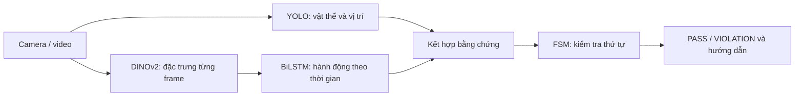

# Giám sát quy trình lắp tai nghe bằng camera

**YOLO + DINOv2 + BiLSTM + FSM**  · Giai đoạn: prototype đang kiểm thử.

`main` giữ model năm lớp; nhánh thử nghiệm dùng insert chung bốn lớp. [Cách đổi nhánh và chọn checkpoint](HUONG_DAN_HAI_NHANH_EARBUD.md). Model năm lớp được tái train vì weights cũ đã bị ghi đè.

Camera theo dõi **mở hộp → lắp hai tai nghe → đóng nắp**. YOLO kiểm tra đúng khe; DINOv2 + LSTM nhận hành động; FSM xác nhận từng bước và báo lỗi. Prototype đã train, đang kiểm thử camera thực tế.

## 1. Dự án giải quyết việc gì?

Hệ thống hỗ trợ kiểm tra người dùng có đặt từng tai nghe vào đúng khe, thực hiện đủ các bước và đóng nắp đúng thời điểm hay không. Khi tai đã lắp bị lấy ra, hệ thống báo lỗi và yêu cầu lắp lại bên bị thiếu.

Tai nghe là bài toán thử nghiệm với thiết bị sẵn có. Sau khi xác minh tính khả thi, kiến trúc có thể được phát triển cho quy trình lắp ráp khác, chẳng hạn PCB, bằng dữ liệu, cấu hình và luật kiểm tra mới.

**Đầu vào:** camera laptop, camera USB hoặc video. **Đầu ra:** bbox vật thể, trạng thái từng khe, tiến độ quy trình, PASS/VIOLATION, hướng dẫn bước tiếp theo và log sự kiện.

## 2. Hệ thống hoạt động thế nào?

| Thành phần | Vai trò |
|---|---|
| YOLO đã fine-tune | Khoanh vùng hộp mở/đóng, tai trái/phải và khe trống trái/phải. |
| `facebook/dinov2-small` | Trích xuất vector 384 chiều từ mỗi frame; backbone đóng băng trong lần train pilot. |
| BiLSTM | Đọc chuỗi 16 vector để phân loại hành động; hai lớp, hidden dimension 256. |
| Fusion + FSM | Đối chiếu hành động với vị trí vật thể, xác nhận bước hoặc yêu cầu sửa lỗi. |

YOLO tạo bbox. DINOv2 cung cấp đặc trưng hình ảnh, không trực tiếp xuất bbox cho bài toán này.

## 3. Quy trình và luật kiểm tra

Quy trình chuẩn: **hộp mở, hai khe trống → tai thứ nhất → tai thứ hai → đóng nắp**. Có thể lắp tai trái hoặc phải trước.

| Tình huống quan sát được | Xử lý hiện tại |
|---|---|
| Tai đúng bên phủ đúng vùng khe đã ghi nhớ, ổn định, LSTM nhận đúng bước | Xác nhận một bước lắp. |
| Tai phải vào khe trái hoặc ngược lại | Báo `wrong_earbud_side`; yêu cầu sửa bên. |
| Khe đã lắp hiện trống trở lại ổn định | Báo tháo tai; lùi FSM và yêu cầu lắp lại đúng bên. |
| Đóng nắp khi chưa xác nhận đủ hai tai | VIOLATION; yêu cầu mở lại và lắp đủ. |
| Mất detection do che khuất | Giữ tiến độ; chưa đủ bằng chứng kết luận tháo tai. |

Ngưỡng hybrid hiện tại: độ phủ khe ≥40%, ổn định 3 lần YOLO nhận diện, confidence LSTM **>0,5**. Độ phủ là diện tích giao bbox tai/khe chia diện tích bbox khe. Vị trí khe được ghi nhớ khi còn trống.

## 4. Model và dữ liệu đang sử dụng

Profile chạy chính: `configs/projects/earbud_v2.json`.

- YOLO: `artifacts/training/earbud_geometry_detector/weights/best.pt`; sáu lớp `open_case`, `close_case`, `left_earbud`, `right_earbud`, `empty_left`, `empty_right`.
- Action model: `artifacts/action_model_pilot/best.pt`, đi cùng `configs/action_earbud_pilot_config.json`; năm hành động `idle`, `open_case`, `insert_first_earbud`, `insert_second_earbud`, `close_case`.
- Action dataset: 35 video, 185 đoạn gán nhãn; chia theo video thành 25 train, 5 validation và 5 test. Các tập vẫn cùng người và có session giao nhau.
- Dataset detection RNN đã được chuẩn hóa riêng: 544 ảnh, 1.059 bbox, bảy lớp gồm thêm `hand`. Đây là thống kê bộ dữ liệu đã kiểm tra, không phải bằng chứng checkpoint hiện tại được train từ toàn bộ bộ này.

Pilot chưa train hành động `remove_earbud`; việc tháo tai được suy ra từ bằng chứng khe trống và trạng thái đã xác nhận.

Pipeline huấn luyện action: **gán nhãn video → chia tập → trích xuất DINOv2 → train BiLSTM → đánh giá**. Khi thêm sản phẩm khác, cần dữ liệu và model phù hợp sản phẩm đó.

## 5. Kết quả đã xác minh

| Hạng mục | Kết quả |
|---|---|
| Validation BiLSTM năm lớp tái train | Macro-F1 **0,9675**, trên 67 cửa sổ dữ liệu. |
| Test BiLSTM | Accuracy **92,98%**, macro-F1 **0,9040**, trên 57 cửa sổ. |
| Checkpoint đang được cấu hình nạp | Đúng YOLO sáu lớp và đúng LSTM pilot DINOv2; đánh giá lại LSTM cho cùng kết quả. |

Đây là chỉ số của **action model trên dữ liệu pilot**, không phải độ chính xác của toàn bộ camera + YOLO + Fusion + FSM. Bước `open_case` còn yếu: recall trên test khoảng 57%. Chưa có kết quả đánh giá tổng quát với người, camera hoặc mẫu tai nghe mới.

## 6. Những lỗi runtime đã sửa và giới hạn còn lại

Ngày 28/09 đã sửa các điểm gây khó xác nhận dù checkpoint nạp đúng:

1. **Nhịp lấy mẫu:** không tự giảm xuống 4 FPS trên CPU; hybrid dùng config train, mục tiêu 10 FPS. Tốc độ thực tế phụ thuộc phần cứng.
2. **Chuỗi đặc trưng:** giữ cửa sổ 16 embedding liên tục sau PASS/VIOLATION, chỉ vô hiệu hóa quyết định cũ; tránh chờ thu lại toàn bộ chuỗi mỗi bước.
3. **Ngưỡng bbox:** YOLO hiển thị và Fusion cùng dùng ≥0,35. Confidence LSTM vẫn >0,5.
4. **Đầu lượt:** ghi nhớ từng khe bằng ba quan sát trống dương tính trong năm lần YOLO gần nhất, thay vì buộc cả hai khe trống ổn định cùng thời điểm. Vẫn cần hộp mở ổn định, không có tai trong hộp và LSTM nhận mở hộp; lắp/tháo giữ ba lần liên tiếp.
5. **Giao diện:** thêm ô xác nhận lớn, lịch sử, trạng thái từng bước và điều kiện đang chờ; chỉ FSM PASS mới đánh dấu hoàn thành. Tháo tai hủy tiến độ tương ứng.
6. **Nhịp YOLO:** chạy theo camera config (mỗi frame), không tự bỏ hai trong ba frame trên CPU. Trên một clip thật 12,49 FPS, mỗi ba frame bỏ lỡ tai thứ hai; mỗi frame xác nhận đủ bốn bước. Đây là kết quả trên một video, không chứng minh tổng quát hóa.

Đã bổ sung test cho luồng xác nhận, khởi tạo khe, rollback và reset. Kiểm thử tự động không thay thế kiểm thử camera thực tế; model vẫn có thể nhận sai hành động/bbox, nhất là mở hộp, che tay hoặc thiết bị mới.

Python hiện cài PyTorch CPU-only dù máy có GPU NVIDIA. Suy luận chạy trên máy; DINOv2 dùng trọng số cache, không gọi API để nhận diện từng frame.

## 7. Việc cần làm để hoàn thiện

1. Kiểm tra bản giao diện mới và đo FPS thực tế, xem điều kiện đang chờ trước khi kết luận chạy realtime ổn định.
2. Kiểm thử có ghi nhận kết quả: lắp đúng, sai khe, tháo từng tai, lắp lại, đóng sớm, tay che và giữ tai lơ lửng trên khe.
3. Bổ sung ảnh khe trống, cảnh khó và video mở hộp; đánh giá trên session/người độc lập.
4. Báo cáo riêng chất lượng YOLO, action model và tỷ lệ phát hiện lỗi của toàn pipeline.
5. Khi đủ ổn định mới thử sản phẩm khác; tạo profile, dataset, model và luật Fusion/FSM mới.

Camera 2D kiểm tra bằng chứng thị giác; chưa chứng minh tai đã khớp cơ khí, tiếp xúc điện hoặc đang sạc.
