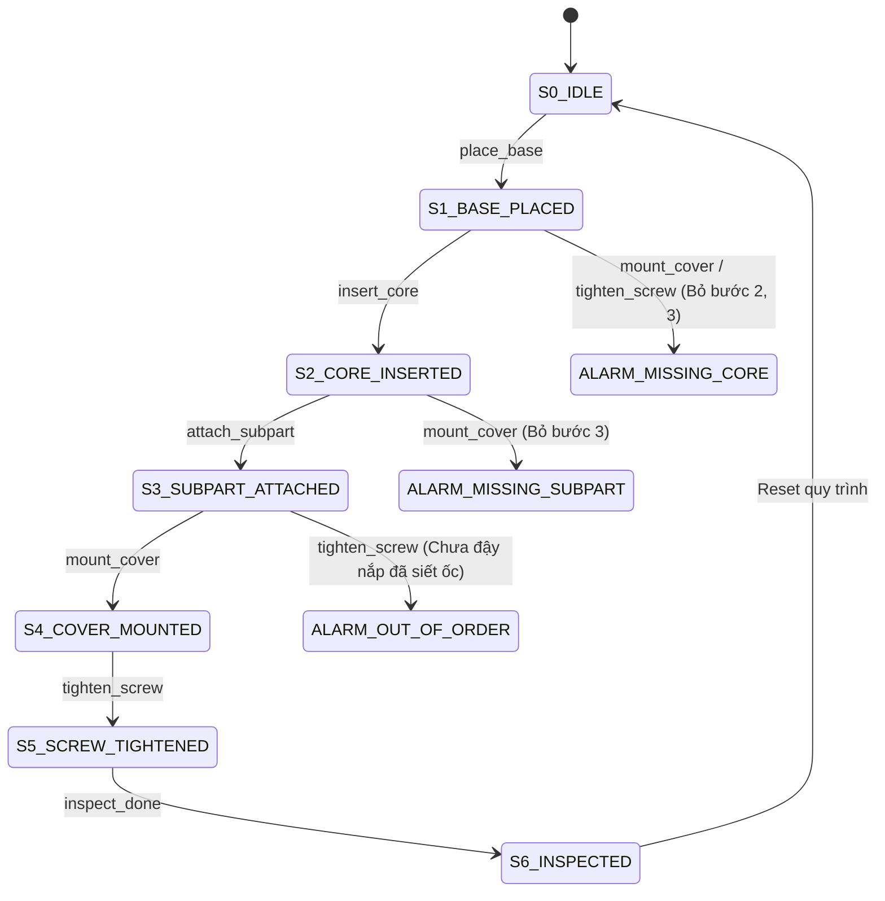

# KẾ HOẠCH & PIPELINE TRIỂN KHAI HỆ THỐNG HYBRID ViT + LSTM GIÁM SÁT HÀNH ĐỘNG LẮP RÁP
*(Hybrid Vision Transformer & LSTM for Real-time Assembly Action Recognition & Sequence Verification)*

---

## 1. TỔNG QUAN DỰ ÁN & MỤC TIÊU

### 1.1. Bối cảnh & Vấn đề thực tế
Trong dây chuyền sản xuất và lắp ráp công nghiệp (điện tử, cơ khí chính xác, thiết bị gia dụng), việc công nhân lắp ráp sai thứ tự, bỏ sót linh kiện (như quên đệm gioăng, quên cắm cáp, bỏ qua bước vặn ốc) là nguyên nhân hàng đầu gây ra sản phẩm lỗi. Hệ thống giám sát truyền thống thường dựa vào cảm biến cơ khí đắt tiền hoặc kiểm tra thủ công (QC) ở cuối chuyền.

**Mục tiêu dự án**: Xây dựng giải pháp camera thị giác máy tính thông minh (Vision-based Poka-Yoke) lắp phía trên bàn làm việc (Top-down view). Hệ thống tự động:
1. Nhận diện hành động công nhân đang thực hiện theo thời gian thực (Real-time Action Recognition).
2. Theo dõi tiến trình lắp ráp theo từng bước (Step-by-step Assembly Tracking).
3. Phát hiện và cảnh báo tức thì khi có vi phạm quy trình (Bỏ bước, làm ngược bước, thao tác sai).
4. Lưu vết sự cố (Evidence logs) phục vụ truy xuất nguồn gốc chất lượng.

---

### 1.2. Nguyên lý Kết hợp Công nghệ (Hybrid Approach)

```text
               +-------------------------------------------------------------+
               |                     CAMERA STREAM (Video)                   |
               +-------------------------------------------------------------+
                                              |
                                     [Downsample / Crop ROI]
                                              |
                                              v
+-----------------------------------------------------------------------------------------+
| SPATIAL LEVEL: Vision Transformer (ViT)                                                 |
| - Nhận từng frame ảnh 224x224.                                                          |
| - Tự động học ngữ cảnh toàn cục (Global Context): Vị trí bàn tay, công cụ, linh kiện    |
|   thông qua cơ chế Self-Attention.                                                      |
| - Trích xuất vector đặc trưng không gian (Embedding d=768) từ [CLS] token.              |
+-----------------------------------------------------------------------------------------+
                                              |
                                [Chuỗi vector T = 16 frames]
                                              |
                                              v
+-----------------------------------------------------------------------------------------+
| TEMPORAL LEVEL: Long Short-Term Memory (LSTM)                                           |
| - Nhận chuỗi các vector đặc trưng theo thời gian: Shape (Batch, T, 768).                |
| - Ghi nhớ mối tương quan quá khứ - hiện tại (Temporal Dependencies), phân biệt được:    |
|   "Đang đưa tay vào lấy ốc" vs "Đang rút tay ra sau khi siết".                          |
| - Dự đoán xác suất lớp hành động (Action Probabilities).                                |
+-----------------------------------------------------------------------------------------+
                                              |
                                              v
+-----------------------------------------------------------------------------------------+
| LOGIC LEVEL: Temporal Smoother + Finite State Machine (FSM)                             |
| - Smoother: Lọc nhiễu chớp nháy dự đoán (Debounce / Majority voting).                  |
| - FSM: Kiểm tra hành động hiện tại có nằm trong luật chuyển trạng thái hợp lệ không.   |
| - Output: Bật tín hiệu xanh (Hợp lệ) hoặc Còi/Đèn đỏ (Sai quy trình).                   |
+-----------------------------------------------------------------------------------------+
```

---

## 2. THIẾT KẾ BÀI TOÁN & BỘ NHÃN (TAXONOMY & ANOMALY MATRIX)

### 2.1. Định nghĩa Kịch bản Mẫu (MVP Assembly Prototype)
Chọn bài toán lắp ráp thiết bị mẫu 4–5 bước (ví dụ: Lắp ráp cụm mạch / Bút bi kỹ thuật / Khối cơ khí nhỏ):

| Bước (State) | Mã hành động (`action_id`) | Tên hành động | Mô tả hành động thực tế |
|---|---|---|---|
| **S0** | `0` | `idle` | Bàn trống, tay công nhân ở trạng thái chờ hoặc chưa thao tác |
| **S1** | `1` | `place_base` | Lấy thân đế / bo mạch đặt vào đồ gá cố định |
| **S2** | `2` | `insert_core` | Cắm khối linh kiện chính / ruột mạch vào socket |
| **S3** | `3` | `attach_subpart`| Gắn cáp nối / lò xo / đệm cao su vào vị trí |
| **S4** | `4` | `mount_cover` | Đặt nắp bảo vệ / vỏ ngoài lên thân |
| **S5** | `5` | `tighten_screw` | Dùng tua-vít / tay siết ốc cố định nắp |
| **S6** | `6` | `inspect_done` | Nhấc cụm thành phẩm lên kiểm tra và đặt vào khay hoàn thành |

---

### 2.2. Ma trận Phát hiện Lỗi (Anomaly & Violation Matrix)



Các tình huống vi phạm bắt buộc hệ thống phải bắt được:
1. **Bỏ bước (Missing Step)**: Đặt nắp (Bước 4) khi chưa cắm linh kiện (Bước 2 hoặc 3).
2. **Làm ngược / Sai thứ tự (Out-of-order)**: Siết ốc khi chưa đặt nắp hoặc chưa cắm cáp.
3. **Thao tác dở dang / Lặp bất thường**: Thao tác diễn ra quá ngắn (< 0.5s) hoặc rút tay ra khi chưa hoàn tất.

---

## 3. KIẾN TRÚC PIPELINE KỸ THUẬT CHI TIẾT

```mermaid
flowchart LR
    subgraph INGESTION ["1. Thu thập & Tiền xử lý"]
        CAM["Camera Top-Down (1080p/720p)"] --> CROP["Crop ROI Bàn thao tác"]
        CROP --> SAMP["Subsampler (10 FPS)"]
        SAMP --> RING["Ring Buffer (T = 16 frames)"]
    end

    subgraph SPATIAL_FEAT ["2. Trích xuất không gian"]
        RING --> VIT["Pre-trained ViT (Frozen / Fine-tuned)"]
        VIT --> EMB["Feature Sequence: (16, 768)"]
    end

    subgraph TEMPORAL_REC ["3. Mô hình chuỗi thời gian"]
        EMB --> LSTM["Bi-LSTM (Hidden=256, Layers=2)"]
        LSTM --> CLF["Linear Head + Softmax"]
        CLF --> PROB["Class Probabilities: P(Action)"]
    end

    subgraph VERIFICATION ["4. Lọc nhiễu & Kiểm tra quy trình"]
        PROB --> DEBOUNCE["Temporal Debounce & Majority Vote (K=5)"]
        DEBOUNCE --> FSM["Finite State Machine Engine"]
        FSM -->|Hợp lệ| UPDATE["Chuyển State Mới"]
        FSM -->|Sai luật| TRIGGER["Kích hoạt Cảnh báo Lỗi"]
    end

    subgraph OUTPUT_STREAM ["5. Hiển thị & Lưu vết"]
        UPDATE --> UI["Giao diện Giám sát (Dashboard)"]
        TRIGGER --> UI
        TRIGGER --> CLIP["Lưu Clip vi phạm (3s trước + 3s sau)"]
        TRIGGER --> DB[(Log sự cố SQLite/JSONL)]
    end
```



---

## 4. KẾ HOẠCH DỰ ÁN THEO 4 GIAI ĐOẠN (PROJECT ROADMAP)

### Giai đoạn 1: Chuẩn bị & Thu thập Dữ liệu (Tuần 1)
* **Mục tiêu**: Có bộ dữ liệu video chuẩn hoá, đã gán nhãn thời gian.
* **Công việc cụ thể**:
  1. **Thiết lập góc quay**: Gắn camera góc nhìn từ trên xuống (Top-down), cố định góc rộng, đủ ánh sáng, không bị bóng gắt.
  2. **Quay video kịch bản chuẩn (Normal)**:
     - 4–5 người khác nhau thực hiện lắp ráp.
     - Mỗi người quay 15–20 lượt làm đúng quy trình hoàn chỉnh.
     - Thay đổi tốc độ: thao tác nhanh, thao tác bình thường, thao tác chậm.
  3. **Quay video kịch bản lỗi (Abnormal)**:
     - Quay 20–30 lượt có chủ đích làm sai: bỏ cắm ruột, quên lò xo, đậy nắp trước khi cắm dây, siết ốc sai vị trí.
  4. **Gán nhãn (Annotation)**:
     - Công cụ: Dùng **CVAT**, **Label Studio** hoặc script Python tự sinh nhãn frame.
     - Format: `[video_id, start_frame, end_frame, action_name, is_anomaly]`.
  5. **Chia tập dữ liệu**: 70% Train, 15% Validation, 15% Test (Chia theo **Video ID / Người thực hiện**, tuyệt đối không chia ngẫu nhiên từng frame).

---

### Giai đoạn 2: Xây dựng & Huấn luyện Mô hình ViT-LSTM (Tuần 2)
* **Mục tiêu**: Huấn luyện bộ phân loại hành động đạt Macro-F1 $\ge 85\%$.
* **Chiến lược 2 giai đoạn (Two-Stage Feature Caching)**:
  1. **Stage 1 - Offline Feature Extraction**:
     - Load pre-trained `google/vit-base-patch16-224` (hoặc `facebook/dinov2-small`).
     - Chạy qua toàn bộ frame của dataset, lấy CLS embedding vector ($1 \times 768$).
     - Lưu thành các file `.pt` hoặc `.npy` theo từng sliding window ($16 \times 768$).
     - *Lợi ích*: Giảm thời gian train từ nhiều ngày xuống còn vài phút, không lo tràn VRAM.
  2. **Stage 2 - Train PyTorch LSTM Classifier**:
     - Xây dựng mạng: `Input(16, 768) -> BiLSTM(hidden=256, layers=2, dropout=0.3) -> FC(128) -> ReLU -> FC(num_classes)`.
     - Loss function: `CrossEntropyLoss` (hoặc `FocalLoss` nếu lớp `idle` chiếm tỉ lệ quá lớn).
     - Optimizer: `AdamW(lr=1e-3, weight_decay=1e-4)`, `CosineAnnealingLR`.
  3. **Đánh giá**:
     - Tính Confusion Matrix, Precision, Recall, Macro-F1 trên tập Validation & Test.

---

### Giai đoạn 3: Logic Máy trạng thái (FSM) & Pipeline Real-time (Tuần 3)
* **Mục tiêu**: Hệ thống chạy trực tiếp từ camera, lọc nhiễu và phát hiện đúng/sai thứ tự.
* **Công việc cụ thể**:
  1. **Sliding Window Buffer**:
     - Tạo Ring Buffer chứa 16 frames gần nhất từ camera (tần số lấy mẫu 10 FPS, độ trễ tương đương 1.6 giây ngữ cảnh).
  2. **Bộ lọc Debouncing (Chống nhấp nháy dự đoán)**:
     - Duy trì hàng đợi 5 kết quả dự đoán gần nhất (`deque(maxlen=5)`).
     - Chỉ chấp nhận hành động nếu hành động đó xuất hiện $\ge 3/5$ lần và có `confidence > 0.80`.
  3. **Xây dựng FSM Engine**:
     - Nạp cấu hình quy trình từ file `fsm_config.yaml`.
     - So khớp hành động mới nhận diện với danh sách `next_valid_actions`.
     - Kích hoạt cảnh báo vi phạm nếu hành động thuộc danh sách cấm hoặc không đúng trình tự.

---

### Giai đoạn 4: Giao diện Giám sát (Dashboard), Tối ưu & Đóng gói (Tuần 4)
* **Mục tiêu**: Hoàn thiện ứng dụng demo trực quan, tối ưu tốc độ $\ge 20$ FPS.
* **Công việc cụ thể**:
  1. **Xây dựng Giao diện (OpenCV Overlay / Streamlit / PyQt)**:
     - Luồng video camera kèm khung trạng thái (State banner).
     - Checklist quy trình hiển thị các bước: Đã hoàn thành (Xanh lá), Đang thực hiện (Vàng), Bước kế tiếp (Xám).
     - Banner cảnh báo lỗi màu đỏ nhấp nháy kèm âm thanh khi có vi phạm.
  2. **Tối ưu hóa Hiệu năng (Optimization)**:
     - Xuất mô hình ViT và LSTM sang định dạng **ONNX Runtime** hoặc **TensorRT** nửa độ chính xác (`FP16`).
     - Tách luồng (Multithreading): 1 Thread chuyên đọc Camera, 1 Thread chuyên Inference + Logic, 1 Thread render UI.
  3. **Đóng gói & Báo cáo nghiệm thu**:
     - Viết hướng dẫn cài đặt `README.md`, video demo kiểm thử, slide thuyết trình dự án.

---

## 5. CẤU TRÚC THƯ MỤC MÃ NGUỒN CHUẨN (PROJECT TREE)

```text
assembly_vit_lstm/
├── configs/
│   ├── fsm_config.yaml             # Cấu hình quy trình FSM & luật vi phạm
│   └── train_config.yaml           # Cấu hình hyperparameter huấn luyện
├── data/
│   ├── raw_videos/                 # Video gốc (train / val / test)
│   ├── annotations/
│   │   ├── train_annotations.json  # Nhãn video tập train
│   │   └── val_annotations.json    # Nhãn video tập val
│   └── features_cache/             # Vectors đặc trưng ViT đã trích xuất (.pt)
├── models/
│   ├── __init__.py
│   ├── vit_extractor.py            # Module trích xuất feature từ ViT
│   └── lstm_classifier.py          # Kiến trúc PyTorch LSTM Action Classifier
├── engine/
│   ├── __init__.py
│   ├── dataset.py                  # PyTorch Dataset & DataLoader
│   ├── fsm_tracker.py              # Finite State Machine kiểm soát quy trình
│   ├── smoother.py                 # Bộ lọc nhiễu thời gian (Debounce & Voting)
│   └── trainer.py                  # Vòng lặp huấn luyện, validation & logging
├── app/
│   ├── realtime_stream.py          # Pipeline chạy thời gian thực từ Webcam / RTSP
│   └── ui_overlay.py               # Module vẽ giao diện cảnh báo trên frame
├── scripts/
│   ├── 01_extract_features.py      # Script chạy Stage 1 trích xuất offline
│   ├── 02_train_lstm.py            # Script train Stage 2 mô hình LSTM
│   └── 03_run_demo.py              # Script khởi chạy ứng dụng giám sát trực tiếp
├── tests/
│   └── test_fsm.py                 # Unit test cho logic FSM
├── requirements.txt                # Danh sách thư viện phụ thuộc
└── README.md                       # Hướng dẫn sử dụng
```

---

## 6. TRIỂN KHAI MÃ NGUỒN CỐT LÕI (IMPLEMENTATION SNIPPETS)

### 6.1. File cấu hình quy trình (`configs/fsm_config.yaml`)

```yaml
# Định nghĩa danh sách hành động
actions:
  0: "idle"
  1: "place_base"
  2: "insert_core"
  3: "attach_subpart"
  4: "mount_cover"
  5: "tighten_screw"
  6: "inspect_done"

# Khởi tạo trạng thái ban đầu
initial_state: "IDLE"

# Máy trạng thái quy trình lắp ráp chuẩn và các vi phạm
states:
  IDLE:
    allowed: ["place_base"]
    message: "Chờ đặt thân đế vào vị trí"
    
  BASE_PLACED:
    allowed: ["insert_core"]
    violations:
      mount_cover: "LỖI: Chưa cắm linh kiện chính mà đã đậy nắp!"
      tighten_screw: "LỖI: Chưa lắp linh kiện mà đã siết ốc!"
      
  CORE_INSERTED:
    allowed: ["attach_subpart"]
    violations:
      mount_cover: "LỖI: Quên gắn lò xo / cáp phụ!"
      tighten_screw: "LỖI: Chưa gắn cáp và nắp mà đã siết ốc!"
      
  SUBPART_ATTACHED:
    allowed: ["mount_cover"]
    violations:
      tighten_screw: "LỖI: Chưa đặt nắp đậy mà đã siết ốc!"
      
  COVER_MOUNTED:
    allowed: ["tighten_screw"]
    violations:
      inspect_done: "LỖI: Chưa siết ốc cố định nắp!"
      
  SCREW_TIGHTENED:
    allowed: ["inspect_done"]
    
  DONE:
    allowed: ["place_base", "idle"]
```

---

### 6.2. Module Trích xuất Feature ViT (`models/vit_extractor.py`)

```python
import torch
import numpy as np
from PIL import Image
from transformers import AutoImageProcessor, AutoModel

class ViTFeatureExtractor:
    """
    Trích xuất vector đặc trưng không gian (Spatial Embedding) từ mỗi frame ảnh
    sử dụng mô hình Vision Transformer pre-trained.
    """
    def __init__(self, model_name="google/vit-base-patch16-224", device=None):
        self.device = device or ("cuda" if torch.cuda.is_available() else "cpu")
        print(f"[INFO] Khởi tạo ViTFeatureExtractor trên thiết bị: {self.device}")
        
        self.processor = AutoImageProcessor.from_pretrained(model_name)
        self.model = AutoModel.from_pretrained(model_name).to(self.device)
        self.model.eval()

    @torch.no_grad()
    def extract_single_frame(self, frame_bgr: np.ndarray) -> torch.Tensor:
        """
        Input: Frame ảnh BGR từ OpenCV (H, W, 3)
        Output: Tensor vector 1D (768,)
        """
        # Chuyển BGR sang RGB
        image_rgb = Image.fromarray(frame_bgr[:, :, ::-1])
        inputs = self.processor(images=image_rgb, return_tensors="pt").to(self.device)
        outputs = self.model(**inputs)
        
        # Lấy embedding của [CLS] token (Shape: 1, 768) -> chuyển thành (768,)
        cls_embedding = outputs.last_hidden_state[:, 0, :].squeeze(0).cpu()
        return cls_embedding

    @torch.no_grad()
    def extract_batch_frames(self, frames_bgr_list: list) -> torch.Tensor:
        """
        Input: Danh sách T frames ảnh BGR
        Output: Tensor 2D (T, 768)
        """
        images_rgb = [Image.fromarray(f[:, :, ::-1]) for f in frames_bgr_list]
        inputs = self.processor(images=images_rgb, return_tensors="pt").to(self.device)
        outputs = self.model(**inputs)
        cls_embeddings = outputs.last_hidden_state[:, 0, :].cpu() # (T, 768)
        return cls_embeddings
```

---

### 6.3. Kiến trúc Mô hình LSTM (`models/lstm_classifier.py`)

```python
import torch
import torch.nn as nn

class TemporalLSTMActionClassifier(nn.Module):
    """
    Mô hình LSTM tiếp nhận chuỗi đặc trưng thời gian (T frames x Feature_dim)
    để phân loại hành động lắp ráp.
    """
    def __init__(self, input_dim=768, hidden_dim=256, num_layers=2, num_classes=7, dropout=0.3):
        super().__init__()
        
        self.lstm = nn.LSTM(
            input_size=input_dim,
            hidden_size=hidden_dim,
            num_layers=num_layers,
            batch_first=True,
            dropout=dropout if num_layers > 1 else 0.0,
            bidirectional=True # Bi-LSTM để nắm bắt ngữ cảnh tốt hơn
        )
        
        # Vì Bi-LSTM nên output feature dimension là hidden_dim * 2
        self.classifier = nn.Sequential(
            nn.Linear(hidden_dim * 2, 128),
            nn.BatchNorm1d(128),
            nn.ReLU(),
            nn.Dropout(dropout),
            nn.Linear(128, num_classes)
        )

    def forward(self, x):
        # x: (Batch_size, Seq_len=16, Feature_dim=768)
        lstm_out, _ = self.lstm(x)
        
        # Lấy hidden state của frame cuối cùng trong cửa sổ thời gian
        last_frame_feat = lstm_out[:, -1, :] # Shape: (Batch_size, hidden_dim * 2)
        logits = self.classifier(last_frame_feat) # Shape: (Batch_size, num_classes)
        return logits
```

---

### 6.4. Bộ lọc Nhiễu & Máy trạng thái FSM (`engine/fsm_tracker.py`)

```python
from collections import deque, Counter
import yaml

class TemporalSmoother:
    """
    Bộ lọc nhiễu thời gian bằng Majority Voting qua cửa sổ trượt
    """
    def __init__(self, window_size=5, min_confidence=0.75):
        self.window_size = window_size
        self.min_confidence = min_confidence
        self.predictions_queue = deque(maxlen=window_size)

    def update(self, action_name: str, confidence: float):
        if confidence >= self.min_confidence:
            self.predictions_queue.append(action_name)
        else:
            self.predictions_queue.append("uncertain")

        if len(self.predictions_queue) < self.window_size:
            return None, 0.0

        # Lấy hành động chiếm đa số
        counter = Counter(self.predictions_queue)
        most_common_action, count = counter.most_common(1)[0]
        ratio = count / self.window_size

        if ratio >= 0.6 and most_common_action != "uncertain":
            return most_common_action, ratio
        return None, 0.0


class AssemblyFSMTracker:
    """
    Máy trạng thái giám sát và phát hiện vi phạm trình tự lắp ráp
    """
    def __init__(self, config_path: str):
        with open(config_path, "r", encoding="utf-8") as f:
            self.config = yaml.safe_load(f)

        self.current_state = self.config.get("initial_state", "IDLE")
        self.states_rule = self.config.get("states", {})
        self.completed_history = []
        self.last_violation = None

    def map_action_to_state(self, action: str) -> str:
        mapping = {
            "place_base": "BASE_PLACED",
            "insert_core": "CORE_INSERTED",
            "attach_subpart": "SUBPART_ATTACHED",
            "mount_cover": "COVER_MOUNTED",
            "tighten_screw": "SCREW_TIGHTENED",
            "inspect_done": "DONE",
            "idle": "IDLE"
        }
        return mapping.get(action, self.current_state)

    def process_action(self, action: str):
        if action == "idle" or action == "uncertain":
            return {"status": "HOLD", "state": self.current_state, "message": "Đang thao tác hoặc nghỉ"}

        target_state = self.map_action_to_state(action)
        if target_state == self.current_state:
            return {"status": "STABLE", "state": self.current_state, "message": f"Đang trong bước {self.current_state}"}

        current_rules = self.states_rule.get(self.current_state, {})
        allowed_actions = current_rules.get("allowed", [])
        violations = current_rules.get("violations", {})

        # 1. Kiểm tra nếu hành động đúng quy trình
        if action in allowed_actions:
            self.current_state = target_state
            self.completed_history.append(action)
            self.last_violation = None
            return {
                "status": "PASS",
                "state": self.current_state,
                "message": f"Hợp lệ: Đã hoàn tất bước {action}"
            }

        # 2. Kiểm tra nếu rơi vào luật vi phạm đã định nghĩa
        if action in violations:
            err_msg = violations[action]
            self.last_violation = err_msg
            return {
                "status": "VIOLATION",
                "state": self.current_state,
                "message": f"CẢNH BÁO: {err_msg}"
            }

        # 3. Vi phạm không xác định (Bất thường ngoài quy trình)
        err_msg = f"Hành động '{action}' không được phép khi đang ở trạng thái '{self.current_state}'!"
        self.last_violation = err_msg
        return {
            "status": "VIOLATION",
            "state": self.current_state,
            "message": f"CẢNH BÁO SAI QUY TRÌNH: {err_msg}"
        }
```

---

### 6.5. Pipeline Chạy Real-time Stream (`app/realtime_stream.py`)

```python
import cv2
import torch
import torch.nn.functional as F
from collections import deque
from models.vit_extractor import ViTFeatureExtractor
from models.lstm_classifier import TemporalLSTMActionClassifier
from engine.fsm_tracker import TemporalSmoother, AssemblyFSMTracker

class AssemblyRealtimeApp:
    def __init__(self, model_checkpoint="checkpoints/vit_lstm_best.pth", config_path="configs/fsm_config.yaml"):
        self.device = "cuda" if torch.cuda.is_available() else "cpu"
        
        # 1. Khởi tạo Modules
        self.feature_extractor = ViTFeatureExtractor(device=self.device)
        self.classifier = TemporalLSTMActionClassifier(num_classes=7).to(self.device)
        
        # Load weights
        checkpoint = torch.load(model_checkpoint, map_location=self.device)
        self.classifier.load_state_dict(checkpoint["model_state_dict"])
        self.classifier.eval()

        self.smoother = TemporalSmoother(window_size=5, min_confidence=0.75)
        self.fsm = AssemblyFSMTracker(config_path)

        # Buffer lưu 16 feature vectors gần nhất (T=16)
        self.feature_buffer = deque(maxlen=16)
        self.action_labels = [
            "idle", "place_base", "insert_core", "attach_subpart",
            "mount_cover", "tighten_screw", "inspect_done"
        ]

    def run(self, video_source=0):
        cap = cv2.VideoCapture(video_source)
        frame_count = 0
        
        current_status_text = "Hệ thống đang khởi động..."
        status_color = (0, 255, 0) # BGR

        while cap.isOpened():
            ret, frame = cap.read()
            if not ret:
                break
            
            frame_count += 1
            # Subsample: Chỉ trích xuất feature mỗi 2 frames để tối ưu FPS
            if frame_count % 2 == 0:
                # Trích xuất ViT embedding
                feat = self.feature_extractor.extract_single_frame(frame)
                self.feature_buffer.append(feat)

                # Khi đủ 16 frames trong buffer, tiến hành nhận diện chuỗi
                if len(self.feature_buffer) == 16:
                    seq_tensor = torch.stack(list(self.feature_buffer)).unsqueeze(0).to(self.device) # (1, 16, 768)
                    with torch.no_grad():
                        logits = self.classifier(seq_tensor)
                        probs = F.softmax(logits, dim=-1).squeeze(0)
                        conf, pred_idx = torch.max(probs, dim=-1)
                        raw_action = self.action_labels[pred_idx.item()]
                        raw_conf = conf.item()

                    # Lọc nhiễu
                    smooth_action, smooth_ratio = self.smoother.update(raw_action, raw_conf)
                    
                    if smooth_action:
                        # Chuyển qua FSM kiểm tra
                        fsm_res = self.fsm.process_action(smooth_action)
                        if fsm_res["status"] == "VIOLATION":
                            status_color = (0, 0, 255) # Đỏ
                            current_status_text = fsm_res["message"]
                        elif fsm_res["status"] == "PASS":
                            status_color = (0, 255, 0) # Xanh lá
                            current_status_text = fsm_res["message"]

            # Vẽ GUI Overlay
            cv2.rectangle(frame, (10, 10), (700, 90), (30, 30, 30), -1)
            cv2.putText(frame, f"State: {self.fsm.current_state}", (20, 40), 
                        cv2.FONT_HERSHEY_SIMPLEX, 0.8, (255, 255, 255), 2)
            cv2.putText(frame, current_status_text, (20, 75), 
                        cv2.FONT_HERSHEY_SIMPLEX, 0.6, status_color, 2)

            cv2.imshow("Assembly Action Monitor (ViT + LSTM)", frame)
            if cv2.waitKey(1) & 0xFF == ord('q'):
                break

        cap.release()
        cv2.destroyAllWindows()
```

---

## 7. TIÊU CHÍ NGHIỆM THU & ĐÁNH GIÁ (ACCEPTANCE METRICS)

| Hạng mục | Chỉ số mục tiêu | Phương pháp đo lường |
|---|---|---|
| **Action Recognition Accuracy** | Macro-F1 $\ge 0.85$ | Đánh giá trên tập Test người chưa từng xuất hiện trong tập Train |
| **Violation Detection Recall** | $\ge 90\%$ | Số lần bắt được lỗi / Tổng số lần cố tình làm sai quy trình |
| **Violation Alarm Precision** | $\ge 90\%$ | Cảnh báo đúng lỗi thật / Tổng số lần hệ thống phát còi báo |
| **False Alarm Rate** | $\le 1$ lần / 30 phút | Thử nghiệm chạy liên tục với quy trình làm chuẩn |
| **End-to-End Latency** | $\le 500\text{ ms}$ | Thời gian từ khi hành động sai xảy ra đến khi hiện cảnh báo đỏ |
| **Realtime FPS** | $\ge 15 - 25\text{ FPS}$ | Chạy trên phần cứng tiêu chuẩn (GPU RTX 3050 / RTX 3060 Laptop) |

---

## 8. CÁC THÁCH THỨC THỰC TẾ & GIẢI PHÁP TỐI ƯU

### 8.1. Vấn đề FPS khi ViT quá nặng
* **Nguyên nhân**: ViT-Base có ~86 triệu tham số, tính Self-Attention trên mỗi frame ảnh 30 FPS gây nghẽn GPU.
* **Giải pháp**:
  1. **Temporal Subsampling**: Chỉ cần trích xuất ở $10\text{ FPS}$ (1 giây lấy 10 frames), các frame trung gian chỉ dùng để hiển thị UI.
  2. **Đổi Backbone nhẹ**: Dùng **`WinKawaks/vit-tiny-patch16-224`** (5.7M params) hoặc **`MobileViT-S`** / **`DINOv2-Small`** để tăng tốc độ lên gấp 4–5 lần.
  3. **Xuất sang ONNX Runtime / TensorRT (FP16)**: Tăng 200–300% throughput trên card NVIDIA.

### 8.2. Hiện tượng Che khuất (Occlusion) & Mất cân bằng dữ liệu
* **Che khuất tay**: Khi tay che mất linh kiện nhỏ (như ốc vít), ViT chỉ thấy bàn tay mà không thấy linh kiện.
  - *Giải pháp*: Kết hợp thông tin Temporal từ LSTM. LSTM sẽ học được rằng trước đó tay đã di chuyển vào khay ốc -> sau đó đưa đến bo mạch thì đó là hành động bắt ốc dù ốc bị che.
* **Mất cân bằng lớp (Class Imbalance)**: Lớp `idle` chiếm $60-70\%$ thời lượng video.
  - *Giải pháp*: Áp dụng **Class-Weighted Cross Entropy Loss** hoặc **Focal Loss ($\gamma=2.0$)** khi train LSTM.

### 8.3. Hướng mở rộng Nâng cao (Next Steps)
1. **Kết hợp Object Detection (YOLO)**: Thêm một nhánh YOLOv8 siêu nhẹ kiểm tra sự hiện diện của linh kiện tại các vùng cố định (ROI Detection) để xác nhận 100% linh kiện đã nằm trên mạch.
2. **Auto-logging Evidence**: Tự động cắt và nén đoạn video clip 5 giây (2s trước lỗi + 3s sau lỗi) lưu vào thư mục `storage/violations/` để quản đốc nhà máy xem lại.
