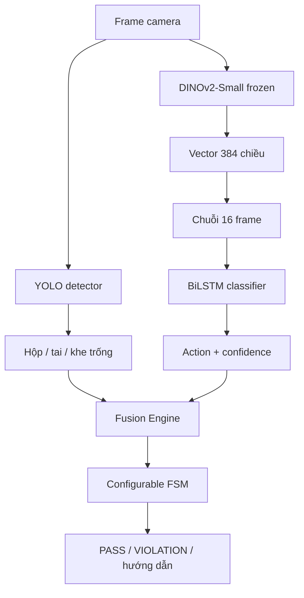

# Thiết kế Hybrid YOLO + DINOv2 + BiLSTM

## Mục tiêu hiện tại

Camera giám sát quy trình hộp tai nghe:

```text
open_case → insert_first_earbud → insert_second_earbud → close_case
```

`idle` là lớp nền/chờ và `remove_earbud` nhận diện chuyển động tháo, vì vậy action model v2 có tổng cộng sáu nhãn.

## Luồng xử lý



## Trách nhiệm của từng khối

- YOLO: bounding box và trạng thái vật thể; không học thứ tự quy trình.
- DINOv2-Small: biến mỗi frame thành embedding 384 chiều; encoder được đóng băng trong baseline.
- BiLSTM: học chuyển động và ngữ cảnh thời gian từ chuỗi embedding.
- Fusion: chỉ phát insertion khi nhãn hành động đúng thứ tự và occupancy thực tế tăng.
- Fusion cũng kiểm tra ghép cặp `left_earbud/right_earbud` với khe tương ứng và dùng `remove_earbud` làm bằng chứng hỗ trợ khi occupancy giảm.
- FSM: chấp nhận/bác bỏ event theo state, báo `wrong_earbud_side` và rollback khi khe trống xuất hiện trở lại.

Với v2, event `open_case` cần cả hộp ổn định từ YOLO và dự đoán `open_case` từ action model. Hai event insertion dùng nhãn riêng; tên `first/second` mô tả occupancy 0→1 và 1→2, không cố định trái/phải.

## Cấu hình mục tiêu

| Khối | File |
|---|---|
| Project profile | `configs/projects/earbud_v2.json` |
| Detector | `configs/camera_earbud_config.json` |
| Action | `configs/action_earbud_v2_config.json` |
| FSM | `configs/earbud_v2_fsm_config.json` |
| Fusion | `src/assembly/earbud_fusion.py` |

Profile `earbud.json` và các config không có hậu tố v2 được giữ để tái hiện baseline, không phải hướng train mới.

## Điều kiện hoàn tất một bước

| Bước | Action evidence | Object evidence |
|---|---|---|
| Mở hộp | `open_case` | Hộp xuất hiện ổn định |
| Tai thứ nhất | `insert_first_earbud` | Occupancy tăng 0→1 |
| Tai thứ hai | `insert_second_earbud` | Occupancy tăng 1→2 |
| Đóng hộp | `close_case` | Đã xác nhận đủ hai tai; detector mới nên có trạng thái hộp đóng |
| Tháo tai | `remove_earbud` | Khe trống xuất hiện lại và occupancy giảm; FSM phát violation/rollback |

Action đúng nhưng vật thể không thay đổi thì không PASS. Vật thể thay đổi nhưng không có action evidence cũng không PASS.

## Dữ liệu và đánh giá

- Detection phải chia theo source video/person/session trước khi lấy frame.
- Action phải chia nguyên video hoặc nguyên person/session; không chia các window cùng video sang nhiều split.
- `--allow-same-session` chỉ dành cho pilot, không dùng làm metric cuối.
- Báo cáo detector theo từng lớp, action model bằng macro-F1/confusion matrix, và hệ thống end-to-end bằng false PASS, violation recall và event delay.

## Mở rộng sang sản phẩm khác

Code `fsm.py`, `monitor.py`, `action_dataset.py` và model temporal dùng chung. Mỗi sản phẩm mới cần profile, class detector, action taxonomy, FSM và fusion riêng. Nhờ vậy dự án PCB sau này không phải sao chép toàn bộ repo.
