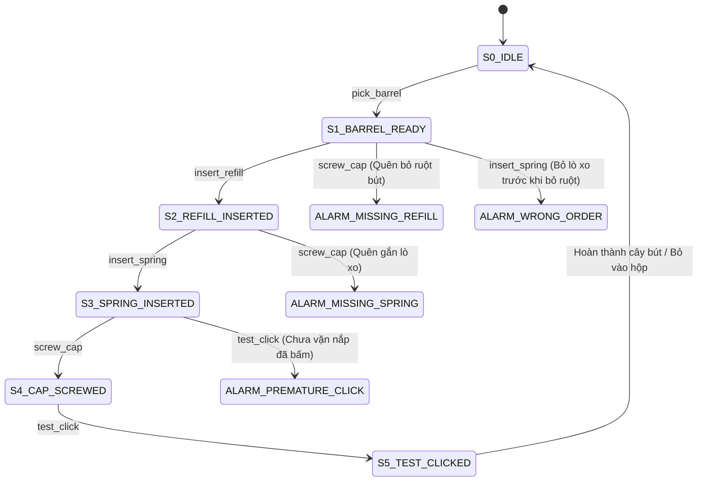

# DỰ ÁN MẪU KHỞI ĐẦU: HỆ THỐNG GIÁM SÁT LẮP RÁP BÚT BI THÔNG MINH
*(Smart Ballpoint Pen Assembly Verification with Hybrid ViT + LSTM)*

---

## 1. VÌ SAO CHỌN BÀI TOÁN LẮP BÚT BI (CLICK PEN ASSEMBLY)?

Khi chưa có bo mạch điện tử hoặc đồ gá công nghiệp, bài toán **Lắp ráp Bút bi bấm (Click Ballpoint Pen)** là mô hình thu nhỏ hoàn hảo nhất để thử nghiệm hệ thống Hybrid ViT + LSTM:
* **Dễ chuẩn bị (Chi phí 0đ)**: Chỉ cần 2–3 cây bút bi bấm thông dụng (ví dụ: Thiên Long, Pilot, Pentel) có sẵn tại nhà/văn phòng.
* **Đầy đủ tính chất công nghiệp**: Có linh kiện dạng que (`refill`), linh kiện nhỏ đàn hồi (`spring`), khớp xoay (`barrel/cap`) và bước kiểm thử cơ học (`click test`).
* **Thời lượng vừa vặn**: Một chu trình lắp chuẩn mất khoảng 5–10 giây (vừa vặn cho cửa sổ trượt $T=16$ frames ở $10\text{ FPS}$).
* **Dễ dàng chuyển giao mã nguồn**: Khi bài toán bút bi chạy thành công, bạn chỉ cần thay đổi file cấu hình `yaml` và tập video để chuyển sang bài toán bo mạch, Lego, hay bất kỳ thiết bị nào khác mà **không cần sửa lại cấu trúc code**.

---

## 2. THIẾT KẾ CHI TIẾT & BỘ NHÃN HÀNH ĐỘNG (ACTION TAXONOMY)

### 2.1. Danh sách Linh kiện & Bố trí Bàn làm việc (Setup)

Bố trí 4 vị trí khay/vùng cố định trên bàn làm việc bằng giấy A4 hoặc băng dính màu:
* **Khay 1 (Trái)**: Thân dưới bút (`lower_barrel`).
* **Khay 2 (Giữa trái)**: Ruột bút (`ink_refill`).
* **Khay 3 (Giữa phải)**: Lò xo (`spring`).
* **Khay 4 (Phải)**: Nắp/Thân trên có nút bấm (`upper_cap`).
* **Vùng Trung tâm (Work Zone)**: Nơi hai bàn tay thực hiện thao tác lắp ráp.

```text
+-------------------------------------------------------------+
|                     CAMERA TOP-DOWN                         |
+-------------------------------------------------------------+
                              |
                              v
+-------------------------------------------------------------+
|  [Khay 1: Thân]   [Khay 2: Ruột]   [Khay 3: Lò xo]   [Khay 4: Nắp] |
|                                                             |
|                 +-----------------------+                   |
|                 |   VÙNG LẮP TRUNG TÂM  |                   |
|                 |      (Work Zone)      |                   |
|                 +-----------------------+                   |
+-------------------------------------------------------------+
```

---

### 2.2. Bộ nhãn Hành động Chuẩn (Action Classes)

| Action ID | Tên nhãn (`action_name`) | Mô tả thao tác thực tế | Thời lượng ước tính |
|:---:|---|---|:---:|
| `0` | `idle` | Tay nghỉ, bàn trống hoặc tay đang di chuyển tự do chưa cầm vật | $1.0 - 2.0\text{s}$ |
| `1` | `pick_barrel` | Cầm thân dưới bút đặt vào vùng trung tâm | $1.0 - 1.5\text{s}$ |
| `2` | `insert_refill` | Cầm ruột bút đút vào bên trong thân bút | $1.5 - 2.0\text{s}$ |
| `3` | `insert_spring` | Lấy lò xo luồn vào đầu ngòi ruột bút | $1.0 - 2.0\text{s}$ |
| `4` | `screw_cap` | Lấy thân trên/nắp vặn khớp chặt vào thân dưới | $2.0 - 3.0\text{s}$ |
| `5` | `test_click` | Bấm nút đuôi bút 2–3 lần để kiểm tra ngòi thò ra/thụt vào | $1.0 - 2.0\text{s}$ |

---

### 2.3. Ma trận Bắt Lỗi & Kịch bản Vi phạm (Anomaly Scenarios)

Hệ thống FSM được thiết lập để bắt các lỗi lắp sai thường gặp:



1. **Lỗi 1 (Quên lò xo - Missing Spring)**: Đút ruột bút xong là vặn nắp luôn (`insert_refill` $\rightarrow$ `screw_cap`).
   - *Hậu quả*: Bút không thể bấm đàn hồi.
   - *Cảnh báo FSM*: `"CẢNH BÁO: Bỏ quên bước gắn lò xo!"`
2. **Lỗi 2 (Quên ruột bút - Missing Refill)**: Cầm thân bút lên vặn nắp ngay (`pick_barrel` $\rightarrow$ `screw_cap`).
   - *Cảnh báo FSM*: `"CẢNH BÁO: Thân bút chưa có ruột mực!"`
3. **Lỗi 3 (Bấm thử khi chưa vặn nắp - Premature Test)**: Chưa vặn nắp mà đã cầm bấm.
   - *Cảnh báo FSM*: `"CẢNH BÁO: Chưa vặn nắp cố định thân bút!"`
4. **Lỗi 4 (Lắp sai thứ tự - Wrong Order)**: Lắp lò xo vào thân rỗng trước khi đưa ruột bút vào.

---

## 3. HƯỚNG DẪN QUAY VIDEO DỮ LIỆU TẠI NHÀ (DATA RECORDING GUIDE)

Bạn có thể dùng **Webcam Laptop**, **Camera USB**, hoặc **Điện thoại cắm tripod** quay từ trên xuống bàn học:

### 3.1. Thiết lập góc quay
* **Góc máy**: Camera nhìn thẳng từ trên xuống (Top-down) hoặc nghiêng 45° chếch từ phía trước.
* **Độ phân giải**: $1920 \times 1080$ hoặc $1280 \times 720$ ở $30\text{ FPS}$.
* **Ánh sáng**: Đủ sáng, không bị bóng đen quá đậm của cánh tay che khuất vùng lắp.

### 3.2. Kế hoạch thu thập video (Tổng ~60 video clips ngắn)

| Loại video | Số lượng clip | Hướng dẫn thực hiện khi quay |
|---|:---:|---|
| **Video Chuẩn (Normal)** | 40 clips | Làm tuần tự đúng 5 bước: `pick_barrel` $\rightarrow$ `insert_refill` $\rightarrow$ `insert_spring` $\rightarrow$ `screw_cap` $\rightarrow$ `test_click`. Quay 2–3 người khác nhau (thay đổi người thao tác, áo tay dài/ngắn). |
| **Lỗi 1: Quên lò xo** | 8 clips | Cầm thân $\rightarrow$ Bỏ ruột $\rightarrow$ Vặn nắp luôn $\rightarrow$ Bấm thử (thấy kẹt). |
| **Lỗi 2: Quên ruột** | 6 clips | Cầm thân $\rightarrow$ Bỏ lò xo $\rightarrow$ Vặn nắp. |
| **Lỗi 3: Ngược bước** | 6 clips | Cầm nắp $\rightarrow$ Bỏ ruột vào nắp $\rightarrow$ Làm lộn xộn. |

> [!TIP]
> **Mẹo quay nhanh**: Bạn có thể quay 1 video dài liên tục 5 phút gồm 10 lượt lắp liên tiếp, sau đó dùng script Python tự động cắt thành các clip ngắn theo từng lượt lắp.

---

## 4. BỘ CẤU HÌNH QUY TRÌNH FSM CHO BÚT BI (`configs/pen_fsm_config.yaml`)

```yaml
# ==========================================================
# CẤU HÌNH MÁY TRẠNG THÁI CHO QUY TRÌNH LẮP RÁP BÚT BI BẤM
# ==========================================================

actions:
  0: "idle"
  1: "pick_barrel"
  2: "insert_refill"
  3: "insert_spring"
  4: "screw_cap"
  5: "test_click"

initial_state: "S0_IDLE"

states:
  S0_IDLE:
    allowed: ["pick_barrel"]
    message: "Hệ thống sẵn sàng: Hãy đặt thân bút vào bàn lắp"

  S1_BARREL_READY:
    allowed: ["insert_refill"]
    violations:
      insert_spring: "LỖI: Chưa đưa ruột bút vào thân mà đã lắp lò xo!"
      screw_cap: "LỖI BỎ BƯỚC: Thân bút rỗng, chưa lắp ruột mực!"
      test_click: "LỖI: Bút chưa hoàn thiện, không thể bấm thử!"
    message: "Đã có thân bút: Hãy đưa ruột bút vào"

  S2_REFILL_INSERTED:
    allowed: ["insert_spring"]
    violations:
      screw_cap: "LỖI BỎ BƯỚC: Quên lắp lò xo trợ lực ngòi bút!"
      test_click: "LỖI: Chưa có lò xo và nắp đậy!"
    message: "Đã cắm ruột bút: Hãy luồn lò xo vào đầu ruột"

  S3_SPRING_INSERTED:
    allowed: ["screw_cap"]
    violations:
      test_click: "LỖI: Chưa vặn nắp cố định thân bút!"
      insert_refill: "CẢNH BÁO: Ruột bút đã có bên trong, không cắm thêm!"
    message: "Đã gắn lò xo: Hãy vặn nắp trên vào thân"

  S4_CAP_SCREWED:
    allowed: ["test_click"]
    violations:
      insert_refill: "LỖI: Nắp đã vặn chặt, không thể đút ruột!"
      insert_spring: "LỖI: Nắp đã vặn chặt, không thể lắp lò xo!"
    message: "Đã vặn chặt nắp: Hãy bấm nút đuôi để kiểm tra ngòi bút"

  S5_TEST_CLICKED:
    allowed: ["pick_barrel", "idle"]
    message: "HOÀN TẤT: Cây bút lắp ráp thành công đạt chuẩn!"
```

---

## 5. CODE MÔ HÌNH VÀ PIPELINE KIỂM THỬ TRỰC TIẾP

Dưới đây là mã nguồn hoàn chỉnh đã cấu hình sẵn theo nhãn lắp bút bi.

### 5.1. File `models/pen_action_net.py` (Mạng lai ViT + Bi-LSTM)

```python
import torch
import torch.nn as nn

class PenAssemblyActionNet(nn.Module):
    """
    Mạng phân loại hành động lắp ráp bút bi:
    - Input: Sequence gồm 16 frame embeddings từ ViT (Batch, 16, 768)
    - Architecture: 2-layer BiLSTM + Dropout + Classifier
    - Output: Logits của 6 lớp hành động
    """
    def __init__(self, input_dim=768, hidden_dim=256, num_layers=2, num_classes=6, dropout=0.3):
        super().__init__()
        self.lstm = nn.LSTM(
            input_size=input_dim,
            hidden_size=hidden_dim,
            num_layers=num_layers,
            batch_first=True,
            dropout=dropout if num_layers > 1 else 0.0,
            bidirectional=True
        )
        self.head = nn.Sequential(
            nn.Linear(hidden_dim * 2, 128),
            nn.BatchNorm1d(128),
            nn.ReLU(),
            nn.Dropout(dropout),
            nn.Linear(128, num_classes)
        )

    def forward(self, x):
        # x shape: (B, T=16, 768)
        lstm_out, _ = self.lstm(x)
        last_hidden = lstm_out[:, -1, :] # Lấy frame cuối cùng của cửa sổ
        logits = self.head(last_hidden)
        return logits
```

---

### 5.2. File `engine/pen_fsm_engine.py` (Bộ lọc nhiễu & Tracker FSM)

```python
from collections import deque, Counter
import yaml

class PenTemporalDebouncer:
    """Lọc nhiễu dự đoán nhấp nháy từ video camera"""
    def __init__(self, window_size=5, min_confidence=0.70):
        self.window_size = window_size
        self.min_confidence = min_confidence
        self.history = deque(maxlen=window_size)

    def update(self, action_name: str, conf: float):
        if conf >= self.min_confidence:
            self.history.append(action_name)
        else:
            self.history.append("uncertain")

        if len(self.history) < self.window_size:
            return None, 0.0

        counter = Counter(self.history)
        top_action, count = counter.most_common(1)[0]
        ratio = count / self.window_size
        if ratio >= 0.60 and top_action != "uncertain":
            return top_action, ratio
        return None, 0.0


class PenAssemblyTracker:
    """Máy trạng thái kiểm soát quy trình lắp bút bi"""
    def __init__(self, config_path="configs/pen_fsm_config.yaml"):
        with open(config_path, "r", encoding="utf-8") as f:
            self.cfg = yaml.safe_load(f)
        
        self.state = self.cfg.get("initial_state", "S0_IDLE")
        self.rules = self.cfg.get("states", {})
        self.completed_steps = []

    def _get_next_state_name(self, action: str):
        action_state_map = {
            "pick_barrel": "S1_BARREL_READY",
            "insert_refill": "S2_REFILL_INSERTED",
            "insert_spring": "S3_SPRING_INSERTED",
            "screw_cap": "S4_CAP_SCREWED",
            "test_click": "S5_TEST_CLICKED"
        }
        return action_state_map.get(action, self.state)

    def update_action(self, action: str):
        if action in ["idle", "uncertain"]:
            return {"type": "INFO", "state": self.state, "msg": "Đang thao tác..."}

        target_state = self._get_next_state_name(action)
        if target_state == self.state:
            return {"type": "INFO", "state": self.state, "msg": f"Đang trong bước {action}"}

        cur_rule = self.rules.get(self.state, {})
        allowed = cur_rule.get("allowed", [])
        violations = cur_rule.get("violations", {})

        # 1. Hợp lệ theo trình tự
        if action in allowed:
            self.state = target_state
            self.completed_steps.append(action)
            return {
                "type": "PASS",
                "state": self.state,
                "msg": f"ĐÚNG QUY TRÌNH: Đã xong bước '{action}'"
            }

        # 2. Rơi vào lỗi vi phạm đã định nghĩa
        if action in violations:
            return {
                "type": "VIOLATION",
                "state": self.state,
                "msg": f"CẢNH BÁO: {violations[action]}"
            }

        # 3. Lỗi không xác định
        return {
            "type": "VIOLATION",
            "state": self.state,
            "msg": f"CẢNH BÁO: Không được làm '{action}' khi đang ở '{self.state}'!"
        }
```

---

### 5.3. File `app/run_pen_monitor.py` (Giao diện Giám sát qua Webcam)

```python
import cv2
import torch
import torch.nn.functional as F
from collections import deque
from PIL import Image
from transformers import AutoImageProcessor, AutoModel
from models.pen_action_net import PenAssemblyActionNet
from engine.pen_fsm_engine import PenTemporalDebouncer, PenAssemblyTracker

# Khởi tạo mô hình
device = "cuda" if torch.cuda.is_available() else "cpu"
print(f"[INFO] Running on device: {device}")

# 1. ViT Extractor (Hugging Face)
vit_name = "google/vit-base-patch16-224"
processor = AutoImageProcessor.from_pretrained(vit_name)
vit_model = AutoModel.from_pretrained(vit_name).to(device)
vit_model.eval()

# 2. LSTM Classifier
lstm_model = PenAssemblyActionNet(num_classes=6).to(device)
# Khi đã train xong, nạp weights:
# lstm_model.load_state_dict(torch.load("checkpoints/pen_lstm_best.pth", map_location=device))
lstm_model.eval()

# 3. Engine kiểm soát
debouncer = PenTemporalDebouncer(window_size=5, min_confidence=0.70)
tracker = PenAssemblyTracker("configs/pen_fsm_config.yaml")

ACTION_LABELS = ["idle", "pick_barrel", "insert_refill", "insert_spring", "screw_cap", "test_click"]

# 4. Webcam Stream
cap = cv2.VideoCapture(0)
feature_ring_buffer = deque(maxlen=16)

status_text = "Hệ thống giám sát lắp bút bi sẵn sàng..."
box_color = (0, 255, 0) # Xanh lá
frame_idx = 0

while cap.isOpened():
    ret, frame = cap.read()
    if not ret:
        break
    
    frame_idx += 1
    # Lấy mẫu ở 10-15 FPS (mỗi 2 frames tính 1 lần)
    if frame_idx % 2 == 0:
        rgb_img = Image.fromarray(frame[:, :, ::-1])
        inputs = processor(images=rgb_img, return_tensors="pt").to(device)
        
        with torch.no_grad():
            vit_out = vit_model(**inputs)
            cls_feat = vit_out.last_hidden_state[:, 0, :].squeeze(0).cpu() # (768,)
            feature_ring_buffer.append(cls_feat)

            if len(feature_ring_buffer) == 16:
                seq_tensor = torch.stack(list(feature_ring_buffer)).unsqueeze(0).to(device) # (1, 16, 768)
                logits = lstm_model(seq_tensor)
                probs = F.softmax(logits, dim=-1).squeeze(0)
                conf, pred_id = torch.max(probs, dim=-1)
                
                raw_act = ACTION_LABELS[pred_id.item()]
                raw_conf = conf.item()

                stable_act, _ = debouncer.update(raw_act, raw_conf)
                if stable_act:
                    res = tracker.update_action(stable_act)
                    if res["type"] == "VIOLATION":
                        box_color = (0, 0, 255) # Đỏ
                        status_text = res["msg"]
                    elif res["type"] == "PASS":
                        box_color = (0, 255, 0) # Xanh lá
                        status_text = res["msg"]

    # Vẽ Giao diện (HUD)
    cv2.rectangle(frame, (15, 15), (780, 100), (35, 35, 35), -1)
    cv2.putText(frame, f"Trang thai: {tracker.state}", (25, 45), 
                cv2.FONT_HERSHEY_SIMPLEX, 0.75, (255, 255, 255), 2)
    cv2.putText(frame, status_text, (25, 85), 
                cv2.FONT_HERSHEY_SIMPLEX, 0.60, box_color, 2)

    cv2.imshow("Smart Pen Assembly Monitor (ViT-LSTM)", frame)
    if cv2.waitKey(1) & 0xFF == ord('q'):
        break

cap.release()
cv2.destroyAllWindows()
```

---

## 6. KẾ HOẠCH THỰC HIỆN TRONG 7 NGÀY (7-DAY FAST TRACK SPRINT)

| Ngày | Nhiệm vụ cụ thể | Đầu ra cần đạt |
|:---:|---|---|
| **Ngày 1** | Chuẩn bị 2 cây bút bi, dán băng dính 4 ô khay linh kiện trên bàn, gắn webcam top-down. | Setup bàn quay hoàn chỉnh. |
| **Ngày 2** | Quay 40 clips làm đúng + 20 clips cố tình làm sai (quên lò xo, quên ruột). | Thư mục `data/raw_videos/` (~60 files .mp4). |
| **Ngày 3** | Viết script trích xuất đặc trưng ViT-Base lưu thành cache files `.pt`. | Thư mục `data/features_cache/` sẵn sàng. |
| **Ngày 4** | Huấn luyện mạng `PenAssemblyActionNet` (BiLSTM) trong 30 epochs. | Model checkpoint `pen_lstm_best.pth` (F1 $\ge 90\%$). |
| **Ngày 5** | Ghép nối `PenTemporalDebouncer` + `PenAssemblyTracker` (FSM) và test logic. | Unit test phát hiện đúng 100% video cố tình làm sai. |
| **Ngày 6** | Chạy trực tiếp qua Webcam (`run_pen_monitor.py`), căn chỉnh ngưỡng confidence. | Hệ thống demo real-time mượt mà. |
| **Ngày 7** | Quay video demo hoàn chỉnh (quay màn hình + quay tay thật thao tác) & đóng gói. | Hoàn thành sản phẩm mẫu (MVP) hoàn hảo. |

---

## 7. KHI NÀO CHUYỂN SANG DỰ ÁN CÔNG NGHIỆP / BO MẠCH?

Sau khi bạn đã hoàn thành bài toán lắp bút bi:
1. Bạn đã nắm vững 100% cách trích xuất feature từ ViT và train LSTM.
2. Bạn đã hiểu cơ chế Sliding Window & Debouncing để chống nhấp nháy trên luồng video trực tiếp.
3. Khi có linh kiện bo mạch, bạn chỉ việc:
   - Quay video lắp bo mạch thay cho bút.
   - Sửa lại tên nhãn trong file `configs/fsm_config.yaml`.
   - Chạy lại script trích xuất feature & train LSTM (mất chưa đầy 1 buổi).
